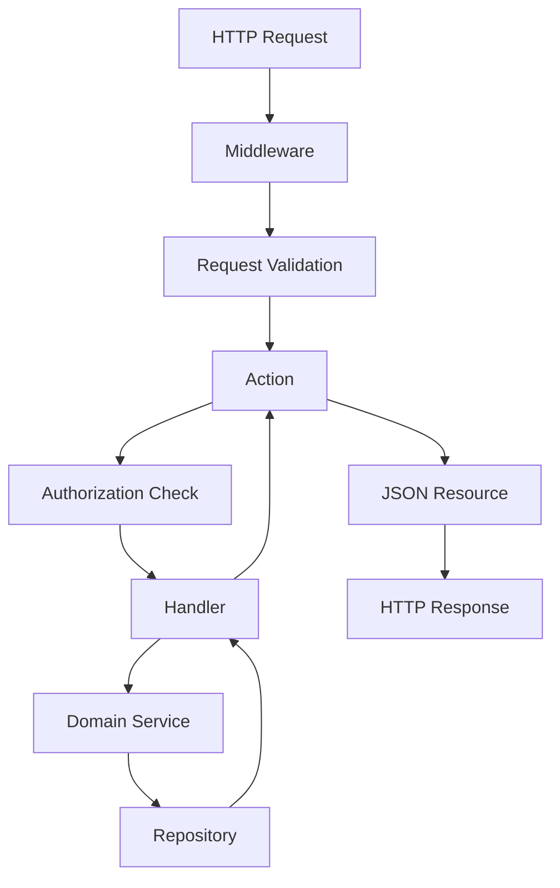

# API Patterns and HTTP Layer

## Overview

The Hi.Events backend HTTP layer uses a standardized pattern built around invokable action classes that extend `BaseAction`. This provides consistent response methods, authorization patterns, and request handling across the entire API.



## BaseAction Pattern

### Core Concept

All HTTP actions extend `BaseAction` which provides standardized methods for:
- Handling responses (JSON, resources, errors)
- Authorization checks
- Authentication
- Request parameter parsing

**File**: `backend/app/Http/Actions/BaseAction.php`

### Action Structure

```php
namespace HiEvents\Http\Actions\PromoCodes;

use HiEvents\Http\Actions\BaseAction;

class CreatePromoCodeAction extends BaseAction
{
    private CreatePromoCodeHandler $handler;

    public function __construct(CreatePromoCodeHandler $handler)
    {
        $this->handler = $handler;
    }

    public function __invoke(CreatePromoCodeRequest $request, int $eventId): JsonResponse
    {
        // 1. Authorization check
        $this->isActionAuthorized($eventId, EventDomainObject::class);

        // 2. Build DTO from validated request
        try {
            $promoCode = $this->handler->handle($eventId, new UpsertPromoCodeDTO(
                code: strtolower($request->input('code')),
                event_id: $eventId,
                discount_type: PromoCodeDiscountTypeEnum::fromName($request->input('discount_type')),
                discount: $request->float('discount'),
                // ...
            ));
        } catch (ResourceConflictException $e) {
            throw ValidationException::withMessages([
                'code' => $e->getMessage(),
            ]);
        }

        // 3. Return resource response
        return $this->resourceResponse(
            PromoCodeResource::class,
            $promoCode,
            ResponseCodes::HTTP_CREATED
        );
    }
}
```

**File**: `backend/app/Http/Actions/PromoCodes/CreatePromoCodeAction.php`

### Key Principles

1. **Single Invokable Method**: Use `__invoke()` magic method
2. **Dependency Injection**: Handler services injected via constructor
3. **Thin Controllers**: Minimal logic - delegate to handlers
4. **Exception Handling**: Convert domain exceptions to ValidationException
5. **Type Safety**: Use DTOs for passing data to handlers

## Response Methods

### resourceResponse()

Transform domain objects/collections into JSON API resources.

```php
protected function resourceResponse(
    string $resource,
    Collection|DomainObjectInterface|LengthAwarePaginator|BaseDTO $data,
    int $statusCode = ResponseCodes::HTTP_OK,
    array $meta = [],
    array $headers = [],
    array $errors = [],
): JsonResponse
```

**Usage**:
```php
return $this->resourceResponse(
    PromoCodeResource::class,
    $promoCode,
    ResponseCodes::HTTP_CREATED
);
```

**Response Format**:
```json
{
  "data": {
    "id": 123,
    "code": "SUMMER2025",
    "discount": 20.00,
    "discount_type": "PERCENTAGE"
  }
}
```

### filterableResourceResponse()

Special response for filterable/sortable resources with metadata.

```php
protected function filterableResourceResponse(
    string $resource,
    Collection|DomainObjectInterface|LengthAwarePaginator $data,
    string $domainObject,
    int $statusCode = ResponseCodes::HTTP_OK,
): JsonResponse
```

**Usage**:
```php
return $this->filterableResourceResponse(
    resource: OrderResource::class,
    data: $orders,
    domainObject: OrderDomainObject::class
);
```

**Response Format**:
```json
{
  "data": [...],
  "meta": {
    "allowed_sorts": ["created_at", "total_gross", "status"],
    "allowed_filters": ["status", "payment_status", "event_id"],
    "pagination": {
      "total": 150,
      "per_page": 20,
      "current_page": 1
    }
  }
}
```

### jsonResponse()

Return raw JSON data (not wrapped in a resource).

```php
protected function jsonResponse(
    mixed $data,
    int $statusCode = ResponseCodes::HTTP_OK,
    bool $wrapInData = false,
): JsonResponse
```

### errorResponse()

Return error response with message.

```php
protected function errorResponse(
    string $message,
    int $statusCode = ResponseCodes::HTTP_BAD_REQUEST,
    array $errors = [],
): JsonResponse
```

**Usage**:
```php
catch (UnauthorizedException $e) {
    return $this->errorResponse(
        message: $e->getMessage(),
        statusCode: ResponseCodes::HTTP_UNAUTHORIZED,
    );
}
```

**Response Format**:
```json
{
  "message": "Unauthorized access",
  "errors": {}
}
```

### deletedResponse()

Return 204 No Content for successful deletions.

```php
protected function deletedResponse(): LaravelResponse
```

**Usage**:
```php
$this->handler->handle($productId, $eventId);
return $this->deletedResponse();
```

### Other Response Methods

```php
protected function notFoundResponse(): LaravelResponse; // 404
protected function noContentResponse(int $status = 204): LaravelResponse; // 204
```

## Authorization Patterns

### isActionAuthorized()

Primary authorization method used throughout the codebase.

```php
protected function isActionAuthorized(
    int $entityId,
    string $entityType,
    Role $minimumRole = Role::ORGANIZER
): void
```

**Usage**:
```php
public function __invoke(int $eventId, Request $request): JsonResponse
{
    // Check if user has access to this event
    $this->isActionAuthorized($eventId, EventDomainObject::class);

    // Continue with action logic...
}
```

### How Authorization Works

The `IsAuthorizedService` performs these checks:

1. **User Status Validation**: Ensures user is ACTIVE
2. **Role Validation**: Checks minimum role requirement
3. **Entity Ownership Validation**: Verifies entity belongs to authenticated account

**Implementation**:
```php
public function isActionAuthorized(
    int $entityId,
    string $entityType,
    UserDomainObject $authUser,
    int $authAccountId,
    Role $minimumRole
): void {
    $this->validateUserStatus($authUser);
    $this->validateUserRole($minimumRole, $authUser);

    // Fetch entity and verify ownership
    $repository = $this->getRepositoryForEntity($entityType);
    $entity = $repository->findById($entityId);

    if ($entity->getAccountId() !== $authAccountId) {
        throw new UnauthorizedException();
    }
}
```

### Alternative Authorization Methods

```php
// For actions that don't need entity-level authorization
protected function minimumAllowedRole(Role $minimumRole): void;

// Get current authenticated user
protected function getAuthenticatedUser(): UserDomainObject;

// Get current authenticated account ID
protected function getAuthenticatedAccountId(): int;

// Check if user is authenticated (boolean)
protected function isUserAuthenticated(): bool;
```

### Public Actions

Public actions don't call `isActionAuthorized()` but may have custom logic:

```php
public function __invoke(int $eventId, Request $request): JsonResponse
{
    $event = $this->handler->handle(GetPublicEventDTO::fromArray([
        'eventId' => $eventId,
        'isAuthenticated' => $this->isUserAuthenticated(),
    ]));

    // Custom authorization
    if (!$this->canUserViewEvent($event)) {
        return $this->notFoundResponse();
    }

    return $this->resourceResponse(EventResourcePublic::class, $event);
}

private function canUserViewEvent(EventDomainObject $event): bool
{
    // Public events are viewable by anyone
    if ($event->getStatus() === EventStatus::LIVE->name) {
        return true;
    }

    // Draft events only viewable by account members
    if ($this->isUserAuthenticated()
        && $event->getAccountId() === $this->getAuthenticatedAccountId()) {
        return true;
    }

    return false;
}
```

## JSON API Resources

### BaseResource

All resources extend `BaseResource`:

**File**: `backend/app/Resources/BaseResource.php`

```php
abstract class BaseResource extends JsonResource
{
    protected static array $additionalData = [];

    public static function collectionWithAdditionalData($resource, $data): JsonResource
    {
        static::$additionalData = $data;
        return static::collection($resource);
    }

    public function getAdditionalDataByKey(string $key)
    {
        return static::$additionalData[$key] ?? null;
    }
}
```

### Simple Resource

**File**: `backend/app/Resources/PromoCode/PromoCodeResource.php`

```php
/**
 * @mixin PromoCodeDomainObject
 */
class PromoCodeResource extends JsonResource
{
    public function toArray(Request $request): array
    {
        return [
            'id' => $this->getId(),
            'code' => $this->getCode(),
            'applicable_product_ids' => $this->getApplicableProductIds(),
            'discount' => $this->getDiscount(),
            'discount_type' => $this->getDiscountType(),
            'created_at' => $this->getCreatedAt(),
            'updated_at' => $this->getUpdatedAt(),
            'expiry_date' => $this->getExpiryDate(),
            'max_allowed_usages' => $this->getMaxAllowedUsages(),
        ];
    }
}
```

### Resource with Nested Resources

**File**: `backend/app/Resources/Order/OrderResource.php`

```php
/**
 * @mixin OrderDomainObject
 */
class OrderResource extends BaseResource
{
    public function toArray(Request $request): array
    {
        return [
            'id' => $this->getId(),
            'short_id' => $this->getShortId(),
            'total_gross' => $this->getTotalGross(),
            'status' => $this->getStatus(),

            // Conditional nested resources
            'order_items' => $this->when(
                !is_null($this->getOrderItems()),
                fn() => OrderItemResource::collection($this->getOrderItems())
            ),
            'attendees' => $this->when(
                !is_null($this->getAttendees()),
                fn() => AttendeeResource::collection($this->getAttendees())
            ),
            'latest_invoice' => $this->when(
                !is_null($this->getLatestInvoice()),
                fn() => (new InvoiceResource($this->getLatestInvoice()))->toArray($request),
            ),
        ];
    }
}
```

### Resource Patterns

1. **@mixin Annotation**: Provides IDE autocomplete
```php
/**
 * @mixin EventDomainObject
 */
```

2. **Use Getter Methods**: Always use domain object methods
```php
'id' => $this->getId(),
'title' => $this->getTitle(),
```

3. **Conditional Fields**: Use `$this->when()` for optional fields
```php
'settings' => $this->when(
    !is_null($this->getSettings()),
    fn() => new SettingsResource($this->getSettings())
),
```

4. **Nested Resources**: Transform related objects
```php
'order_items' => OrderItemResource::collection($this->getOrderItems()),
```

5. **Collections**: Use `Resource::collection()` for arrays
```php
'products' => ProductResource::collection($this->getProducts()),
```

## Routing Patterns

**File**: `backend/routes/api.php`

### Route Organization

Routes are organized into three groups:

#### 1. Public Routes (No Authentication)

```php
$router->prefix('/auth')->group(function (Router $router): void {
    $router->post('/login', LoginAction::class)->name('auth.login');
    $router->post('/register', CreateAccountAction::class);
    $router->post('/forgot-password', ForgotPasswordAction::class);
});

$router->prefix('/public')->group(function (Router $router): void {
    $router->get('/events/{event_id}', GetEventPublicAction::class);
    $router->post('/events/{event_id}/order', CreateOrderActionPublic::class);
    $router->get('/organizers/{organizer_id}', GetPublicOrganizerAction::class);
});
```

#### 2. Authenticated Routes (Require JWT)

```php
$router->middleware(['auth:api'])->group(function (Router $router): void {
    // User routes
    $router->get('/users/me', GetMeAction::class);
    $router->post('/users', CreateUserAction::class);

    // Event routes
    $router->post('/events', CreateEventAction::class);
    $router->get('/events/{event_id}', GetEventAction::class);
    $router->put('/events/{event_id}', UpdateEventAction::class);

    // Nested resource routes
    $router->post('/events/{event_id}/products', CreateProductAction::class);
    $router->get('/events/{event_id}/attendees', GetAttendeesAction::class);
});
```

### Common Route Patterns

```php
// CRUD operations
POST   /events                           CreateEventAction
GET    /events                           GetEventsAction
GET    /events/{event_id}                GetEventAction
PUT    /events/{event_id}                UpdateEventAction

// Status updates (separate from full updates)
PUT    /events/{event_id}/status         UpdateEventStatusAction

// Nested resources
POST   /events/{event_id}/products       CreateProductAction
GET    /events/{event_id}/products       GetProductsAction
GET    /events/{event_id}/products/{id}  GetProductAction

// Special actions
POST   /events/{event_id}/duplicate      DuplicateEventAction
POST   /events/{event_id}/orders/export  ExportOrdersAction
```

### Naming Conventions

- **Controller-less**: Routes point directly to Action classes
- **REST-like**: Follow RESTful patterns with HTTP verbs
- **Nested Resources**: Parent resource ID in path
- **Named Routes**: Optional for reverse routing

## Request Validation

### BaseRequest

All request classes extend `BaseRequest`:

**File**: `backend/app/Http/Request/BaseRequest.php`

```php
abstract class BaseRequest extends FormRequest
{
}
```

### Simple Validation

**File**: `backend/app/Http/Request/PromoCode/CreateUpdatePromoCodeRequest.php`

```php
class CreateUpdatePromoCodeRequest extends BaseRequest
{
    public function rules(): array
    {
        return [
            'code' => 'min:2|string|required|max:50',
            'applicable_product_ids' => 'array',
            'discount' => [
                'required_if:discount_type,PERCENTAGE,FIXED',
                'numeric',
                'min:0',
                // Custom validation closure
                function ($attribute, $value, $fail) {
                    if ($this->input('discount_type') === PromoCodeDiscountTypeEnum::PERCENTAGE->name
                        && $value > 100) {
                        $fail('The discount percentage must be less than or equal to 100%.');
                    }
                },
            ],
            'expiry_date' => 'date|nullable',
            'max_allowed_usages' => 'nullable|gte:1|max:9999999',
            'discount_type' => [
                'required',
                Rule::in(PromoCodeDiscountTypeEnum::valuesArray())
            ],
        ];
    }
}
```

### Reusable Validation Traits

**File**: `backend/app/Http/Request/Event/CreateEventRequest.php`

```php
class CreateEventRequest extends BaseRequest
{
    use EventRules;  // Reusable validation trait

    public function rules(): array
    {
        return $this->eventRules();
    }

    public function messages(): array
    {
        return $this->eventMessages();
    }
}
```

### Validation Features

1. **Laravel Validation Rules**: Standard syntax
2. **Custom Closures**: Inline custom validation
3. **Enum Validation**: `Rule::in(Enum::valuesArray())`
4. **Conditional Rules**: `required_if:field,value`
5. **Custom Messages**: Override via `messages()` method
6. **Reusable Traits**: Share logic across requests

### Automatic Validation

Request validation happens automatically before `__invoke()` is called. Failed validation returns 422 Unprocessable Entity with error details.

## Complete Request Flow

### Example: Create Organizer

**Route**:
```php
$router->post('/organizers', CreateOrganizerAction::class);
```

**Action**: `backend/app/Http/Actions/Organizers/CreateOrganizerAction.php`

```php
class CreateOrganizerAction extends BaseAction
{
    public function __construct(
        private readonly CreateOrganizerHandler $handler
    ) {}

    public function __invoke(UpsertOrganizerRequest $request): JsonResponse
    {
        $organizerData = array_merge(
            $request->validated(),
            ['account_id' => $this->getAuthenticatedAccountId()]
        );

        $organizer = $this->handler->handle(
            organizerData: CreateOrganizerDTO::fromArray($organizerData),
        );

        return $this->resourceResponse(
            resource: OrganizerResource::class,
            data: $organizer,
            statusCode: ResponseCodes::HTTP_CREATED,
        );
    }
}
```

**Request/Response Flow**:

```
POST /api/organizers
Authorization: Bearer {jwt_token}
Content-Type: application/json

{
  "name": "My Organization",
  "email": "info@myorg.com"
}

↓ Middleware validates JWT
↓ UpsertOrganizerRequest validates input
↓ CreateOrganizerAction invoked
↓ getAuthenticatedAccountId() retrieves account
↓ CreateOrganizerHandler creates organizer
↓ OrganizerResource transforms domain object

HTTP/1.1 201 Created
Content-Type: application/json

{
  "data": {
    "id": 123,
    "name": "My Organization",
    "email": "info@myorg.com",
    "account_id": 456,
    "created_at": "2025-10-29T..."
  }
}
```

## Best Practices

### 1. Always Extend BaseAction

```php
// ✅ GOOD
class CreateEventAction extends BaseAction
{
    public function __invoke(Request $request): JsonResponse
    {
        return $this->resourceResponse(...);
    }
}

// ❌ BAD
class CreateEventAction
{
    public function __invoke(Request $request): JsonResponse
    {
        return response()->json(['data' => ...]);
    }
}
```

### 2. Use Standardized Response Methods

```php
// ✅ GOOD
return $this->resourceResponse(EventResource::class, $event, ResponseCodes::HTTP_CREATED);

// ❌ BAD
return response()->json(['data' => $event], 201);
```

### 3. Authorize Before Processing

```php
public function __invoke(int $eventId, Request $request): JsonResponse
{
    // Authorization first
    $this->isActionAuthorized($eventId, EventDomainObject::class);

    // Then processing
    $result = $this->handler->handle(...);

    return $this->resourceResponse(...);
}
```

### 4. Convert Domain Exceptions

```php
try {
    $result = $this->handler->handle($dto);
} catch (ResourceConflictException $e) {
    // Convert to Laravel validation exception
    throw ValidationException::withMessages([
        'code' => $e->getMessage(),
    ]);
} catch (DomainException $e) {
    // Or use error response
    return $this->errorResponse(
        message: $e->getMessage(),
        statusCode: ResponseCodes::HTTP_BAD_REQUEST,
    );
}
```

### 5. Use Type Hints

```php
public function __invoke(
    CreateEventRequest $request,  // Type-hinted request
    int $eventId                   // Type-hinted params
): JsonResponse                    // Return type
{
    $dto = CreateEventDTO::fromArray($request->validated());
    $event = $this->handler->handle($dto);

    return $this->resourceResponse(EventResource::class, $event);
}
```

## Exception Handling

### Custom Exceptions

```php
class ResourceConflictException extends Exception {}
class EmailTemplateValidationException extends Exception {
    public array $validationErrors = [];
}
class OrderValidationException extends Exception {}
```

### Handler-Level Exception Handling

```php
public function handle(UpsertDTO $dto): DomainObject
{
    try {
        return $this->repository->create([...]);
    } catch (ResourceConflictException $e) {
        throw ValidationException::withMessages([
            'field' => $e->getMessage(),
        ]);
    }
}
```

### Action-Level Exception Handling

```php
try {
    $result = $this->handler->handle($dto);
} catch (UnauthorizedException $e) {
    return $this->errorResponse(
        message: $e->getMessage(),
        statusCode: ResponseCodes::HTTP_UNAUTHORIZED,
    );
} catch (ValidationException $e) {
    // Laravel handles automatically
    throw $e;
}
```

## Summary

The Hi.Events HTTP layer provides:

1. **Invokable Actions**: Single-purpose action classes extending `BaseAction`
2. **Standardized Responses**: Consistent response methods for all endpoints
3. **Robust Authorization**: Entity-level permission checks via `isActionAuthorized()`
4. **JSON API Resources**: Transform domain objects to API responses
5. **RESTful Routing**: Clear separation of public/authenticated routes
6. **Request Validation**: Laravel FormRequest with reusable traits
7. **Clean Architecture**: Clear boundaries between HTTP, Application, and Domain

**Complete Request Flow**:
```
HTTP Request
    ↓
Middleware (auth, CORS)
    ↓
Request Validation
    ↓
Action (__invoke)
    ↓
Authorization Check
    ↓
Handler (orchestration)
    ↓
Domain Service (business logic)
    ↓
Repository (data access)
    ↓
Domain Object (returned)
    ↓
JSON Resource (transformation)
    ↓
HTTP Response
```

## Related Documentation

- [Architecture Overview](architecture-overview.md)
- [Domain-Driven Design](domain-driven-design.md)
- [Repository Pattern](repository-pattern.md)
- [Events and Jobs](events-and-jobs.md)
