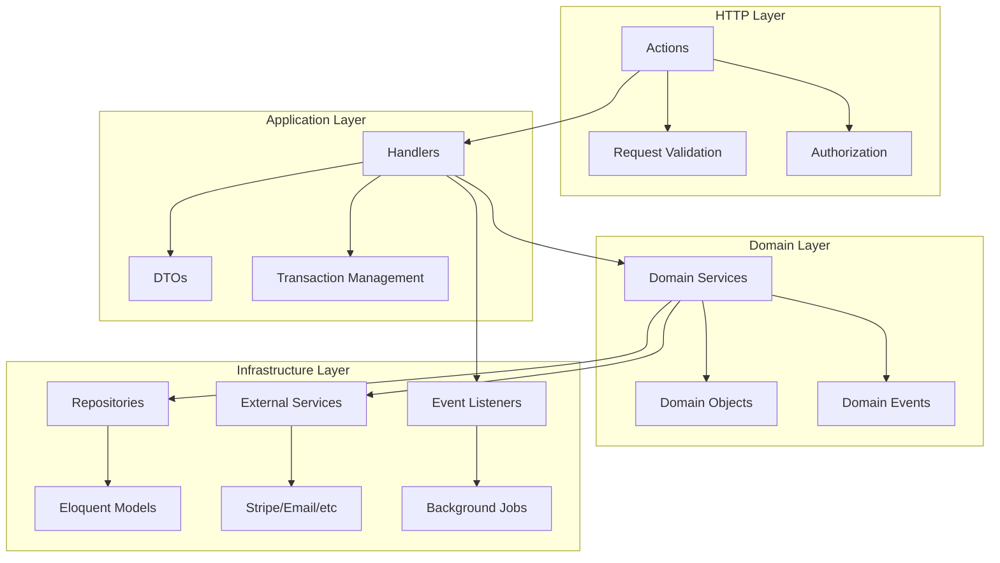
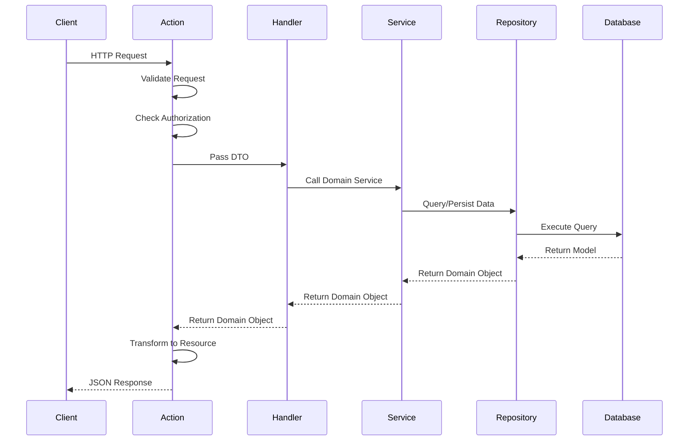

# Hi.Events Backend Architecture Overview

## Introduction

Hi.Events is an open-source event management and ticketing platform built with Laravel. The backend implements a **Domain-Driven Design (DDD)** architecture with clear separation of concerns, enabling maintainable, testable, and scalable code.

## High-Level Architecture



## Architectural Layers

### 1. HTTP Layer (`app/Http/`)
**Responsibility**: Handle HTTP requests and responses

- **Actions** (`app/Http/Actions/`) - Invokable controllers
- **Requests** (`app/Http/Request/`) - Validation rules
- **Resources** (`app/Http/Resources/`) - JSON API transformers
- **Middleware** - Authentication, authorization, CORS

**Key Pattern**: All actions extend `BaseAction` which provides standardized response methods and authorization checks.

### 2. Application Layer (`app/Services/Application/Handlers/`)
**Responsibility**: Orchestrate domain services and manage use cases

- **Handlers** - One per use case (e.g., `CreateOrderHandler`, `UpdateEventHandler`)
- **DTOs** - Data Transfer Objects for passing data between layers
- **Transaction Management** - Ensure data consistency
- **Event Dispatching** - Trigger side effects

**Key Pattern**: Handlers receive DTOs from actions and orchestrate domain services.

### 3. Domain Layer (`app/Services/Domain/`)
**Responsibility**: Core business logic

- **Domain Services** - Business logic implementation
- **Domain Objects** (`app/DomainObjects/`) - Type-safe data representations
- **Enums** (`app/DomainObjects/Enums/`, `app/DomainObjects/Status/`) - Domain constants
- **Validators** - Business rule validation

**Key Pattern**: Services are highly focused (single responsibility) and compose to handle complex operations.

### 4. Infrastructure Layer
**Responsibility**: External concerns and technical implementations

- **Repositories** (`app/Repository/`) - Data access abstraction
- **External Services** (`app/Services/Infrastructure/`) - Stripe, email, etc.
- **Event Listeners** (`app/Listeners/`) - React to domain events
- **Background Jobs** (`app/Jobs/`) - Asynchronous processing
- **Database** - Eloquent models and migrations

**Key Pattern**: Infrastructure depends on domain interfaces, not vice versa.

## Core Components

### Domain Objects
Auto-generated immutable representations of database entities.

- **Generated** via `php artisan generate-domain-objects`
- **Abstract classes** in `app/DomainObjects/Generated/` (read-only)
- **Concrete classes** in `app/DomainObjects/` (customizable)
- Provide type-safe getters/setters and constants for field names

### DTOs (Data Transfer Objects)
Immutable data containers for passing data between layers.

- **Modern**: Extend `BaseDataObject` (using Spatie Laravel Data)
- **Legacy**: Extend `BaseDTO` (being phased out)
- Use constructor property promotion with readonly properties
- Type-safe with enums and primitives

### Repositories
Interface-based data access layer.

- **40+ base methods** for CRUD operations
- Return domain objects, never Eloquent models
- Support eager loading, pagination, filtering
- Registered in `RepositoryServiceProvider`

### Events & Jobs
Dual event system for internal workflows and external integrations.

- **Application Events** (`app/Events/`) - Internal domain logic
- **Infrastructure Events** (`app/Services/Infrastructure/DomainEvents/`) - Webhooks
- **Listeners** (`app/Listeners/`) - React to events, dispatch jobs
- **Jobs** (`app/Jobs/`) - Asynchronous processing with retry logic

## Request Flow



## Key Design Patterns

### 1. Dependency Injection
All services, repositories, and handlers use constructor injection for dependencies.

```php
class CreateOrderHandler
{
    public function __construct(
        private readonly OrderRepositoryInterface $orderRepository,
        private readonly OrderManagementService $orderManagementService,
        private readonly DatabaseManager $databaseManager,
    ) {}
}
```

### 2. Repository Pattern
All data access goes through repository interfaces.

```php
interface OrderRepositoryInterface extends RepositoryInterface
{
    public function findByEventId(int $eventId, QueryParamsDTO $params): LengthAwarePaginator;
}
```

### 3. DTO Pattern
Data passed between layers using immutable DTOs.

```php
class CreateOrderDTO extends BaseDataObject
{
    public function __construct(
        public readonly int $eventId,
        public readonly Collection $products,
        public readonly ?string $promoCode = null,
    ) {}
}
```

### 4. Service Layer Pattern
Business logic encapsulated in focused service classes.

```php
class MarkOrderAsPaidService
{
    public function markOrderAsPaid(int $orderId, int $eventId): OrderDomainObject
    {
        return DB::transaction(function() {
            // Business logic
        });
    }
}
```

### 5. Event-Driven Architecture
Domain events enable decoupled communication.

```php
OrderStatusChangedEvent::dispatch($order);
// Triggers: email sending, statistics updates, webhook delivery
```

## Multi-Tenancy Architecture

Hi.Events implements account-based multi-tenancy:

```
Account (Tenant)
├── Users (many-to-many with roles)
├── Organizers
│   └── Events
│       ├── Products/Tickets
│       ├── Orders
│       ├── Attendees
│       └── Settings
```

- Each account is an independent tenant
- Data isolation through `account_id` foreign keys
- User context: `User::getCurrentAccountId()`

## Technology Stack

- **Framework**: Laravel 11
- **Database**: PostgreSQL with JSONB support
- **Authentication**: JWT (Laravel Passport/Sanctum)
- **Queue**: Laravel Queues (Redis/Database)
- **Cache**: Redis
- **Payment**: Stripe with Stripe Connect
- **Email**: Laravel Mail

## Best Practices

### 1. Always Use DTOs
Pass data to handlers using DTOs, not arrays or individual parameters.

✅ **Good**:
```php
$handler->handle(new CreateOrderDTO(...));
```

❌ **Bad**:
```php
$handler->handle($eventId, $products, $promoCode);
```

### 2. Use Domain Object Constants
Reference fields using constants, not strings.

✅ **Good**:
```php
$repository->findWhere([OrderDomainObjectAbstract::STATUS => 'COMPLETED']);
```

❌ **Bad**:
```php
$repository->findWhere(['status' => 'COMPLETED']);
```

### 3. Favor Base Repository Methods
Use existing repository methods before creating custom ones.

✅ **Good**:
```php
$repository->findFirstWhere(['event_id' => $eventId]);
```

❌ **Bad**:
```php
$repository->findByEventId($eventId); // Custom method for common pattern
```

### 4. Extend BaseAction for HTTP
All HTTP actions should extend `BaseAction` and use its response methods.

✅ **Good**:
```php
return $this->resourceResponse(OrderResource::class, $order, ResponseCodes::HTTP_CREATED);
```

❌ **Bad**:
```php
return response()->json(['data' => $order], 201);
```

### 5. Use Enums for Constants
Define domain constants as enums, not arrays or class constants.

✅ **Good**:
```php
enum OrderStatus { case COMPLETED; case CANCELLED; }
```

❌ **Bad**:
```php
class OrderStatus { const COMPLETED = 'completed'; }
```

## File Organization

```
backend/app/
├── Console/              # Artisan commands
├── DomainObjects/        # Auto-generated domain objects
│   ├── Generated/        # Don't edit
│   ├── Enums/           # General enums
│   └── Status/          # Status enums
├── Events/              # Application events
├── Exceptions/          # Custom exceptions
├── Http/
│   ├── Actions/         # Invokable controllers
│   ├── Request/         # Form requests
│   └── Resources/       # JSON API resources
├── Jobs/                # Background jobs
├── Listeners/           # Event listeners
├── Models/              # Eloquent models
├── Repository/
│   ├── Interfaces/      # Repository contracts
│   └── Eloquent/        # Implementations
├── Services/
│   ├── Application/     # Application handlers
│   │   └── Handlers/    # Use case handlers
│   ├── Domain/          # Domain services
│   └── Infrastructure/  # External services
└── Validators/          # Validation rules
```

## Testing Strategy

- **Unit Tests** (`tests/Unit/`) - Test handlers and services in isolation
- Use `DatabaseTransactions` trait, not `RefreshDatabase`
- Mock repositories using Mockery
- Test both success and failure paths
- Run: `php artisan test --testsuite=Unit`

## Performance Considerations

- **Eager Loading**: Use `loadRelation()` to avoid N+1 queries
- **Indexes**: All foreign keys and frequently queried fields are indexed
- **JSONB**: Use PostgreSQL JSONB for flexible schema
- **Queue**: Offload heavy operations to background jobs
- **Caching**: Cache expensive queries and computed data

## Security

- **Authorization**: Entity-level checks via `isActionAuthorized()`
- **Authentication**: JWT tokens with account context
- **Validation**: All inputs validated via FormRequests
- **SQL Injection**: Protected by Eloquent ORM
- **CSRF**: API uses token-based auth (no CSRF)

## Related Documentation

- [Domain-Driven Design Patterns](domain-driven-design.md)
- [Database Schema Architecture](database-schema.md)
- [Repository Pattern Guide](repository-pattern.md)
- [Events and Jobs System](events-and-jobs.md)
- [API Patterns and HTTP Layer](api-patterns.md)
