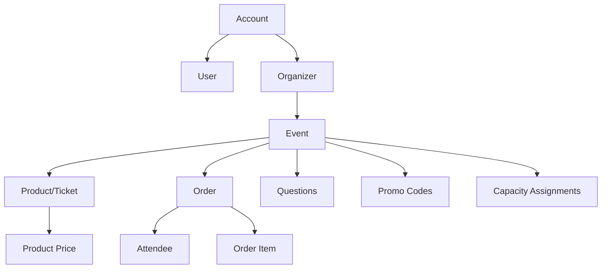
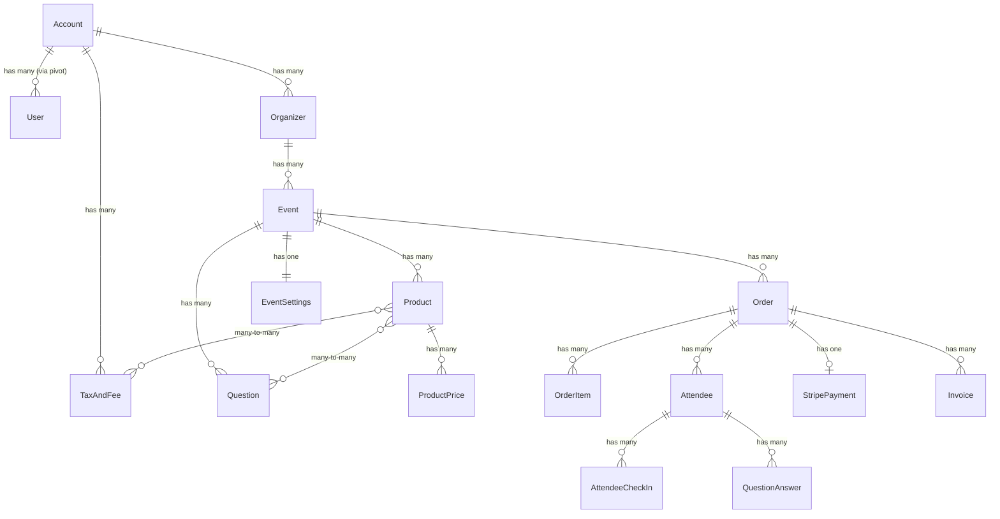

# Database Schema Architecture

## Overview

Hi.Events uses PostgreSQL with a multi-tenant architecture built around accounts. The database schema consists of approximately 57 migration files with core schema defined in `database/migrations/schema.sql`.

## Core Entity Hierarchy



## Multi-Tenancy Architecture

### Account-Based Tenancy

```
Account (Tenant)
├── Users (many-to-many via account_users)
│   └── Role-based permissions
├── Account Configuration
│   └── Application fees
├── Taxes and Fees (account-level)
├── Email Templates (account-level)
├── Organizers
│   ├── Organizer Settings
│   ├── Email Templates (organizer-level)
│   └── Events
│       ├── Event Settings
│       ├── Event Statistics
│       ├── Email Templates (event-level)
│       ├── Products (Tickets)
│       ├── Orders
│       ├── Attendees
│       ├── Questions
│       ├── Promo Codes
│       └── Webhooks
```

### Key Principles

1. **Data Isolation**: Each account's data is isolated via `account_id` foreign key
2. **Hierarchical Structure**: Account → Organizer → Event → Products/Orders
3. **User Access**: Users can belong to multiple accounts with different roles
4. **Cascade Deletes**: Parent deletion cascades to children

## Core Entities

### 1. Account & User Management

#### accounts
Top-level tenant entity.

**Key Fields**:
- `id` - Primary key
- `name` - Account name
- `email` - Account contact email
- `currency_code` - Default currency
- `timezone` - Default timezone
- `stripe_account_id` - Stripe Connect ID
- `stripe_connect_setup_complete` - Onboarding status
- `account_verified_at` - Verification timestamp

**Model**: `app/Models/Account.php`

#### users
User authentication and identity.

**Key Fields**:
- `id` - Primary key
- `email` - Unique email (authentication)
- `password` - Hashed password
- `first_name`, `last_name` - User name
- `timezone` - User timezone
- `email_verified_at` - Email verification
- `status` - User status (ACTIVE/INACTIVE)

**Features**:
- JWT authentication
- Soft deletes
- Can belong to multiple accounts

**Model**: `app/Models/User.php`

#### account_users (Pivot)
Many-to-many relationship with roles.

**Key Fields**:
- `account_id` - Foreign key to accounts
- `user_id` - Foreign key to users
- `role` - User role (ADMIN, ORGANIZER, etc.)
- `is_account_owner` - Owner flag
- `invited_by_user_id` - Invitation tracking
- `status` - Invitation status
- `last_login_at` - Login tracking

**Features**: RBAC (Role-Based Access Control)

#### account_configuration
Account-level configuration for fees.

**Key Fields**:
- `id` - Primary key
- `name` - Configuration name
- `is_system_default` - System default flag
- `application_fees` - JSONB fee structure

**Migration**: `database/migrations/2025_02_16_163546_create_account_configuration.php`

### 2. Event Management

#### organizers
Event organizers (one account can have multiple).

**Key Fields**:
- `id` - Primary key
- `account_id` - Foreign key (CASCADE delete)
- `name` - Organizer name
- `email`, `phone`, `website` - Contact info
- `currency` - Default currency
- `timezone` - Default timezone

**Model**: `app/Models/Organizer.php`

#### events
Core event entity.

**Key Fields**:
- `id` - Primary key
- `account_id` - Foreign key (CASCADE delete)
- `organizer_id` - Foreign key
- `user_id` - Creator
- `title`, `description` - Event details
- `start_date`, `end_date` - Event dates
- `status` - EventStatus enum (DRAFT, LIVE, ARCHIVED)
- `location`, `location_details` - JSONB location data
- `currency`, `timezone` - Event-specific settings
- `short_id` - URL-friendly ID
- `category` - Event category

**Model**: `app/Models/Event.php`

**Relationships**:
- Has many Products, Orders, Attendees, Questions
- Has one EventSettings, EventStatistics
- Belongs to Account, Organizer, User

#### event_settings
Detailed event configuration.

**Key Fields**:
- `event_id` - Primary key (one-to-one)
- `pre_checkout_message`, `post_checkout_message` - Custom messages
- `support_email` - Support contact
- `require_attendee_details` - Attendee form requirement
- `order_timeout_in_minutes` - Reservation timeout
- `homepage_*_color` - Branding colors
- `seo_*` - SEO metadata
- `ticket_design_settings` - JSONB ticket design

**Features**: Complete control over event UX

### 3. Products & Pricing

#### products (formerly tickets)
Tickets/products for events.

**Key Fields**:
- `id` - Primary key
- `event_id` - Foreign key (CASCADE delete)
- `title`, `description` - Product details
- `type` - Product type
- `product_type` - TICKET or OTHER
- `sale_start_date`, `sale_end_date` - Sale window
- `min_per_order`, `max_per_order` - Purchase limits
- `product_category_id` - Category
- `order` - Display order

**Model**: `app/Models/Product.php`

**Migration**: Renamed from `tickets` in `database/migrations/2024_09_20_032323_rename_tickets_to_products.php`

**Relationships**:
- Belongs to Event, ProductCategory
- Has many ProductPrices
- Many-to-many with TaxesAndFees, Questions, CapacityAssignments, CheckInLists

#### product_prices
Multiple pricing tiers per product.

**Key Fields**:
- `id` - Primary key
- `product_id` - Foreign key
- `price` - Price amount
- `label` - Price tier name (e.g., "Early Bird", "VIP")
- `sale_start_date`, `sale_end_date` - Time-based pricing
- `initial_quantity_available` - Starting quantity
- `quantity_sold` - Sold count
- `quantity_available` - Remaining
- `order` - Display order

**Features**:
- Time-based pricing (early bird, etc.)
- Inventory tracking per tier

#### product_categories
Organize products into categories.

**Key Fields**:
- `id` - Primary key
- `event_id` - Foreign key
- `name`, `description` - Category details
- `order` - Display order

#### taxes_and_fees
Account-level tax and fee definitions.

**Key Fields**:
- `id` - Primary key
- `account_id` - Foreign key
- `name` - Tax/fee name
- `type` - TAX or FEE enum
- `calculation_type` - FIXED or PERCENTAGE
- `rate` - Amount/percentage
- `is_active` - Active flag
- `is_default` - Auto-apply to new products

**Features**: Automatically applies default taxes to new tickets

### 4. Orders & Transactions

#### orders
Customer purchases.

**Key Fields**:
- `id` - Primary key
- `short_id`, `public_id` - URL-friendly IDs
- `event_id` - Foreign key
- `first_name`, `last_name`, `email` - Customer info
- `status` - OrderStatus enum (RESERVED, COMPLETED, etc.)
- `payment_status` - Payment state
- `refund_status` - Refund state
- `payment_gateway`, `payment_provider` - Payment method
- `currency` - Order currency
- `total_before_additions` - Subtotal
- `total_tax`, `total_fee` - Tax/fee totals
- `total_gross` - Grand total
- `total_refunded` - Refund amount
- `promo_code_id` - Applied promo code
- `affiliate_id` - Attribution
- `address` - JSONB address
- `taxes_and_fees_rollup` - JSONB tax breakdown
- `point_in_time_data` - JSONB pricing snapshot
- `reserved_until` - Reservation expiry
- `locale` - Order language

**Model**: `app/Models/Order.php`

**Features**:
- GIN trigram indexes on name/email for search
- Point-in-time pricing snapshot
- Order timeout/reservation system

**Relationships**:
- Belongs to Event, PromoCode, Affiliate
- Has many OrderItems, Attendees, Invoices
- Has one StripePayment, OrderApplicationFee

#### order_items
Line items in orders.

**Key Fields**:
- `id` - Primary key
- `order_id` - Foreign key
- `product_id` - Foreign key
- `product_price_id` - Specific price tier
- `quantity` - Item count
- `price` - Unit price
- `price_before_discount` - Pre-discount price
- `total_before_additions` - Subtotal
- `total_tax`, `total_service_fee` - Additions
- `total_gross` - Line total
- `taxes_and_fees_rollup` - JSONB breakdown
- `product_type` - TICKET or OTHER

**Model**: `app/Models/OrderItem.php`

**Features**: No timestamps (immutable once created)

#### stripe_payments
Stripe payment tracking.

**Key Fields**:
- `id` - Primary key
- `order_id` - Foreign key
- `payment_intent_id` - Stripe payment intent
- `charge_id` - Stripe charge
- `payment_method_id` - Payment method
- `amount_received` - Actual amount
- `connected_account_id` - Stripe Connect account
- `last_error` - JSON error details
- `platform` - Stripe platform used

**Model**: `app/Models/StripePayment.php`

#### invoices
Invoice generation for orders.

**Key Fields**:
- `id` - Primary key
- `order_id` - Foreign key
- `account_id` - Foreign key
- `invoice_number` - Unique invoice number
- `issue_date`, `due_date` - Invoice dates
- `total_amount` - Invoice total
- `status` - Invoice status
- `items` - JSONB line items
- `taxes_and_fees` - JSONB tax breakdown
- `uuid` - Public UUID
- `payment_terms`, `notes` - Invoice details

**Model**: `app/Models/Invoice.php`

**Migration**: `database/migrations/2025_01_03_010511_create_invoices_table.php`

### 5. Attendees & Check-Ins

#### attendees
Individual ticket holders.

**Key Fields**:
- `id` - Primary key
- `short_id`, `public_id` - URL-friendly IDs
- `order_id` - Foreign key (CASCADE delete)
- `product_id` - Foreign key (CASCADE delete)
- `product_price_id` - Price tier
- `event_id` - Foreign key (CASCADE delete)
- `first_name`, `last_name`, `email` - Attendee info
- `status` - AttendeeStatus enum
- `locale` - Attendee language
- `notes` - Internal notes

**Model**: `app/Models/Attendee.php`

**Features**:
- GIN trigram indexes for search
- Soft deletes

**Relationships**:
- Belongs to Order, Product, Event
- Has many AttendeeCheckIns, QuestionAnswers

#### check_in_lists
Multiple check-in lists per event.

**Key Fields**:
- `id` - Primary key
- `event_id` - Foreign key
- `short_id` - URL-friendly ID
- `name`, `description` - List details
- `activates_at`, `expires_at` - Active window

**Model**: `app/Models/CheckInList.php`

**Migration**: `database/migrations/2024_08_08_032637_create_check_in_lists_tables.php`

**Features**: Supports multiple entry points or sessions

#### attendee_check_ins
Track individual check-in events.

**Key Fields**:
- `id` - Primary key
- `short_id` - URL-friendly ID
- `check_in_list_id` - Foreign key
- `product_id`, `attendee_id`, `order_id`, `event_id` - References
- `ip_address` - Check-in source

**Model**: `app/Models/AttendeeCheckIn.php`

**Features**: Supports multiple check-ins per attendee

### 6. Questions & Answers

#### questions
Custom form questions.

**Key Fields**:
- `id` - Primary key
- `event_id` - Foreign key
- `title` - Question text
- `type` - QuestionTypeEnum (TEXT, CHECKBOX, etc.)
- `required` - Required flag
- `options` - JSONB options for multiple choice
- `belongs_to` - ORDER or ATTENDEE level
- `order` - Display order
- `is_hidden` - Hidden flag
- `description` - Help text

**Model**: `app/Models/Question.php`

**Relationships**: Many-to-many with Products

#### question_answers
Store answers to questions.

**Key Fields**:
- `id` - Primary key
- `question_id` - Foreign key
- `order_id` - Order-level answer
- `attendee_id` - Attendee-level answer
- `product_id` - Product context
- `answer` - JSONB answer data

**Model**: `app/Models/QuestionAnswer.php`

#### question_and_answer_views (View)
Materialized view for efficient querying.

**Model**: `app/Models/QuestionAndAnswerView.php`

**Purpose**: Pre-joined data for question/answer reporting

### 7. Capacity Management

#### capacity_assignments
Manage capacity limits.

**Key Fields**:
- `id` - Primary key
- `event_id` - Foreign key
- `name` - Capacity name
- `capacity` - Total capacity
- `used_capacity` - Used amount
- `applies_to` - EVENT or PRODUCTS
- `status` - Active status

**Model**: `app/Models/CapacityAssignment.php`

**Migration**: `database/migrations/2024_07_14_031511_create_capacity_assignments_and_associated_tables.php`

**Features**: Share capacity across multiple products

### 8. Promotions & Marketing

#### promo_codes
Discount codes.

**Key Fields**:
- `id` - Primary key
- `event_id` - Foreign key
- `code` - Promo code (indexed)
- `discount` - Discount amount
- `discount_type` - NONE, FIXED, PERCENTAGE
- `applicable_product_ids` - JSONB product restrictions
- `expiry_date` - Expiration
- `max_allowed_usages` - Usage limit
- `attendee_usage_count`, `order_usage_count` - Usage tracking

**Model**: `app/Models/PromoCode.php`

**Features**:
- Product-specific codes
- Usage tracking
- JSONB index on applicable_product_ids

#### affiliates
Affiliate tracking.

**Key Fields**:
- `id` - Primary key
- `event_id`, `account_id` - Foreign keys
- `name` - Affiliate name
- `code` - Unique tracking code (indexed)
- `email` - Contact email
- `total_sales` - Sale count
- `total_sales_gross` - Revenue
- `status` - AffiliateStatus enum

**Model**: `app/Models/Affiliate.php`

**Features**: Attribution tracking for marketing

### 9. Communication

#### email_templates
Customizable email templates.

**Key Fields**:
- `id` - Primary key
- `account_id`, `organizer_id`, `event_id` - Three-level hierarchy
- `template_type` - Template type enum
- `subject`, `body` - Email content
- `cta` - JSON call-to-action
- `engine` - liquid (Liquid template engine)
- `is_active` - Active flag

**Model**: `app/Models/EmailTemplate.php`

**Migration**: `database/migrations/2025_08_28_100704_create_email_templates_table.php`

**Features**: Account → Organizer → Event override hierarchy

#### messages
Bulk messaging to attendees.

**Key Fields**:
- `id` - Primary key
- `event_id` - Foreign key
- `subject`, `message` - Message content
- `type` - Message type
- `recipient_ids`, `product_ids`, `attendee_ids` - JSONB targeting
- `sent_by_user_id` - Sender
- `status` - Send status
- `sent_at` - Sent timestamp

**Model**: `app/Models/Message.php`

### 10. Analytics & Statistics

#### event_statistics
Aggregate statistics per event.

**Key Fields**:
- `event_id` - Primary key (one-to-one)
- `unique_views`, `total_views` - View tracking
- `sales_total_gross`, `sales_total_before_additions` - Revenue
- `total_tax`, `total_fee`, `total_refunded` - Breakdown
- `products_sold` - Sold count
- `orders_created`, `orders_cancelled` - Order metrics
- `attendees_registered` - Attendee count
- `version` - Optimistic locking

**Model**: `app/Models/EventStatistic.php`

**Features**: Optimistic locking via version field

#### event_daily_statistics
Daily breakdown.

**Key Fields**: Same as event_statistics plus `date`

**Model**: `app/Models/EventDailyStatistic.php`

### 11. Webhooks & Integration

#### webhooks
Outgoing webhook configuration.

**Key Fields**:
- `id` - Primary key
- `event_id`, `account_id`, `user_id` - Foreign keys
- `url` - Webhook URL
- `event_types` - JSONB subscribed events
- `status` - WebhookStatus enum
- `secret` - Webhook secret
- `last_response_code`, `last_response_body` - Delivery tracking
- `last_triggered_at` - Last trigger time

**Model**: `app/Models/Webhook.php`

**Migration**: `database/migrations/2025_02_09_074739_create_webhooks_table.php`

#### webhook_logs
Audit log for deliveries.

**Key Fields**:
- `webhook_id` - Foreign key
- `payload` - JSONB payload sent
- `event_type` - Event type
- `response_code`, `response_body` - Response tracking

**Model**: `app/Models/WebhookLog.php`

### 12. Media & Assets

#### images
Polymorphic image storage.

**Key Fields**:
- `id` - Primary key
- `entity_id`, `entity_type` - Polymorphic relation
- `account_id` - Foreign key
- `type` - Image type
- `filename`, `disk`, `path` - Storage details
- `size`, `mime_type` - File metadata

**Model**: `app/Models/Image.php`

**Features**: Attach to any entity via polymorphic relationship

## Key Architectural Patterns

### 1. Soft Deletes
Nearly all entities use soft deletes via `deleted_at` timestamp.

**Benefits**:
- Data recovery
- Audit trails
- Referential integrity

### 2. Timestamps
All tables have `created_at` and `updated_at` (except order_items).

### 3. Foreign Key Cascades

**Common cascade behaviors**:
```sql
-- Event deletion cascades to children
ALTER TABLE products ADD CONSTRAINT FOREIGN KEY (event_id)
    REFERENCES events(id) ON DELETE CASCADE;

-- Order deletion cascades to attendees
ALTER TABLE attendees ADD CONSTRAINT FOREIGN KEY (order_id)
    REFERENCES orders(id) ON DELETE CASCADE;
```

### 4. JSONB for Flexible Data

**Extensive use of PostgreSQL JSONB**:
- `orders.point_in_time_data` - Pricing snapshot
- `orders.taxes_and_fees_rollup` - Tax breakdown
- `orders.address` - Billing/shipping address
- `events.location_details` - Structured location
- `questions.options` - Question choices
- `promo_codes.applicable_product_ids` - Product restrictions
- `invoices.items` - Invoice line items

**Benefits**: Schema flexibility without migrations

### 5. GIN Trigram Indexes

For fast full-text search:

```sql
CREATE INDEX orders_first_name_trgm ON orders
    USING gin(first_name gin_trgm_ops);
```

**Tables**: orders, attendees
**Columns**: first_name, last_name, email, public_id

**PostgreSQL Extension**: pg_trgm (trigram matching)

### 6. Short IDs & Public IDs

User-facing entities use URL-friendly IDs:
- `short_id` - Short identifier
- `public_id` - Public identifier

**Purpose**: Obfuscate internal IDs, friendly URLs

### 7. Optimistic Locking

Event statistics use version field:

```sql
UPDATE event_statistics
SET sales_total = sales_total + 100, version = version + 1
WHERE event_id = 123 AND version = 5;
```

**Prevents**: Race conditions in high-concurrency updates

### 8. Point-in-Time Data

Orders preserve pricing at creation time:

```sql
orders.point_in_time_data = {
  "products": [...],
  "event_settings": {...},
  "promo_code": {...}
}
```

**Benefits**: Historical accuracy after event changes

## Database Technology

### PostgreSQL-Specific Features

1. **JSONB**: Native JSON with indexing
2. **pg_trgm**: Trigram matching for search
3. **Generated Columns**: Auto-incrementing IDs
4. **GIN Indexes**: For JSONB and text search
5. **Database Views**: Complex query optimization
6. **CHECK Constraints**: Enum validation

### Schema Evolution

- **57+ migrations**: Iterative development
- **Major refactors**: tickets → products (2024)
- **Recent additions**: email templates, webhooks, invoices (2025)

## Entity Relationship Summary



## Related Documentation

- [Architecture Overview](architecture-overview.md)
- [Repository Pattern](repository-pattern.md)
- [Domain-Driven Design](domain-driven-design.md)
