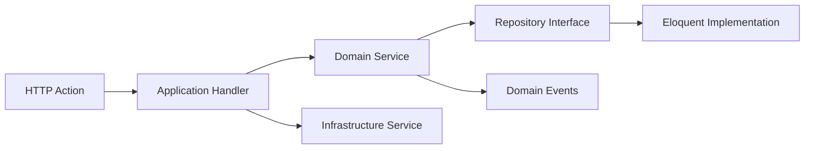
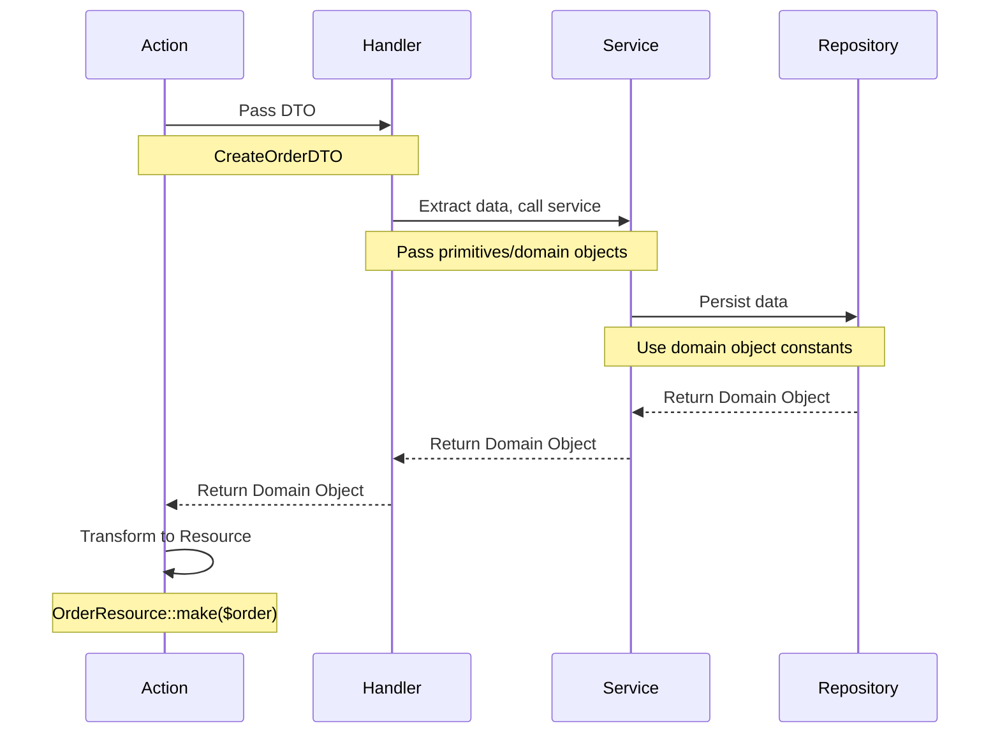

# Domain-Driven Design in Hi.Events

## Overview

Hi.Events implements a clean DDD architecture with clear separation between Application Handlers, Domain Services, and Infrastructure Services. This document explains the patterns, responsibilities, and best practices for each layer.

## Architecture Layers



## 1. Application Layer

**Location**: `backend/app/Services/Application/Handlers/`

### Purpose
Orchestration layer that coordinates domain services and handles cross-cutting concerns.

### Responsibilities
- Receive DTOs from HTTP Actions
- Orchestrate multiple domain services
- Manage database transactions
- Handle logging and error management
- Dispatch domain events
- Transform domain objects back to DTOs/responses

### Handler Pattern

Each handler:
- Has a single `handle()` method
- Accepts a DTO as input
- Returns a domain object or DTO
- Uses dependency injection

**Example**: `backend/app/Services/Application/Handlers/Order/MarkOrderAsPaidHandler.php`

```php
class MarkOrderAsPaidHandler
{
    public function __construct(
        private readonly MarkOrderAsPaidService $markOrderAsPaidService,
        private readonly LoggerInterface $logger,
    ) {}

    public function handle(MarkOrderAsPaidDTO $dto): OrderDomainObject
    {
        $this->logger->info(__('Marking order as paid'), [
            'order_id' => $dto->orderId,
            'event_id' => $dto->eventId,
        ]);

        return $this->markOrderAsPaidService->markOrderAsPaid(
            $dto->orderId,
            $dto->eventId,
        );
    }
}
```

### Key Characteristics
- **Thin orchestration** - Delegate logic to services
- **Transaction boundaries** - Wrap multi-step operations
- **Event dispatching** - Trigger side effects
- **Error transformation** - Convert domain exceptions

### Naming Convention
- Pattern: `{Action}{Entity}Handler`
- Examples: `CreateOrderHandler`, `UpdateEventHandler`, `DeleteProductHandler`

## 2. Domain Services Layer

**Location**: `backend/app/Services/Domain/`

### Purpose
Core business logic implementation organized by domain concepts.

### Key Domain Areas
- **Order**: Order management, payment processing, cancellation
- **Product**: Product creation, validation, pricing
- **Event**: Event creation, statistics, duplication
- **Auth**: Login, password reset, authentication
- **Payment**: Stripe integration, refunds, webhooks
- **Attendee**: Ticket sending, check-ins
- **Tax**: Tax/fee calculations
- **PromoCode**: Validation and application

### Service Characteristics

```php
class CreateProductService
{
    public function __construct(
        private readonly ProductRepositoryInterface $productRepository,
        private readonly TaxAndProductAssociationService $taxService,
        private readonly ProductPriceCreateService $priceCreateService,
        private readonly HtmlPurifierService $purifier,
        private readonly DomainEventDispatcherService $eventDispatcher,
    ) {}

    public function createProduct(
        ProductDomainObject $product,
        Collection $prices
    ): ProductDomainObject {
        return DB::transaction(function() use ($product, $prices) {
            // 1. Persist product
            $persistedProduct = $this->productRepository->create([
                ProductDomainObjectAbstract::TITLE => $product->getTitle(),
                // ...
            ]);

            // 2. Associate taxes
            $this->taxService->associateTaxesAndFees($persistedProduct->getId());

            // 3. Create prices
            $this->priceCreateService->createPrices($persistedProduct, $prices);

            // 4. Dispatch event
            $this->eventDispatcher->dispatch(
                new ProductEvent(
                    type: DomainEventType::PRODUCT_CREATED,
                    productId: $persistedProduct->getId()
                )
            );

            return $persistedProduct;
        });
    }
}
```

### Domain Service Guidelines

**DO**:
- Encapsulate business logic
- Focus on single responsibility
- Compose other domain services
- Return domain objects or specialized DTOs
- Throw domain-specific exceptions
- Dispatch domain events

**DON'T**:
- Handle HTTP concerns
- Know about controllers or actions
- Deal with authentication/authorization directly
- Format responses for API

### Naming Conventions
- Action-oriented: `Create*Service`, `Update*Service`, `Delete*Service`
- Process-oriented: `*ProcessingService`, `*CalculationService`
- Utility-oriented: `*ValidationService`, `*ManagementService`

## 3. Data Transfer Objects (DTOs)

**Location**: `backend/app/Services/Application/Handlers/*/DTO/`

### Modern Pattern: BaseDataObject

**Always use** `BaseDataObject` (Spatie Laravel Data) for new DTOs.

```php
class UpsertProductDTO extends BaseDataObject
{
    public function __construct(
        public readonly int $eventId,
        public readonly string $title,
        public readonly ?string $description,
        public readonly ProductType $type,
        /**
         * @var Collection<ProductPriceDTO>
         */
        public readonly Collection $prices,
        public readonly ?int $productCategoryId = null,
        public readonly ?int $maxPerOrder = null,
    ) {}
}
```

### Key Features
- **Constructor promotion**: Concise syntax
- **Readonly properties**: Immutability
- **Type safety**: Enums and primitives
- **Optional parameters**: With defaults
- **Nested DTOs**: Using `Collection` or `#[CollectionOf]`

### Legacy Pattern: BaseDTO

**Deprecated** - Do not use for new code.

```php
// DON'T DO THIS - BaseDTO is deprecated
class OldDTO extends BaseDTO { }

// DO THIS INSTEAD
class NewDTO extends BaseDataObject { }
```

### DTO Best Practices

1. **Always extend BaseDataObject**
```php
class CreateWebhookDTO extends BaseDataObject { }
```

2. **Use readonly properties**
```php
public readonly string $url,
public readonly WebhookStatus $status,
```

3. **Integrate enums directly**
```php
public readonly EmailTemplateEngine $engine = EmailTemplateEngine::LIQUID,
```

4. **Document collections**
```php
/**
 * @var Collection<ProductDTO>
 */
public readonly Collection $products,
```

## 4. Domain Objects

**Location**: `backend/app/DomainObjects/`

### What Are Domain Objects?

Auto-generated, immutable data representations that mirror the database schema.

### Generation Process

```bash
php artisan generate-domain-objects
```

This command:
1. Reads database schema using Doctrine DBAL
2. Generates abstract classes in `Generated/` folder
3. Generates concrete classes (only if they don't exist)

### Structure

**Abstract Class** (`Generated/EventDomainObjectAbstract.php`):
```php
abstract class EventDomainObjectAbstract extends AbstractDomainObject
{
    // Constants for field names
    final public const ID = 'id';
    final public const TITLE = 'title';
    final public const STATUS = 'status';

    // Typed properties
    protected int $id;
    protected string $title;
    protected ?string $status = null;

    // Getters and setters
    public function setId(int $id): self
    {
        $this->id = $id;
        return $this;
    }

    public function getId(): int
    {
        return $this->id;
    }
}
```

**Concrete Class** (`EventDomainObject.php`):
```php
class EventDomainObject extends EventDomainObjectAbstract
{
    private ?Collection $products = null;

    // Custom business logic
    public function isEventInPast(): bool
    {
        return $this->end_date && $this->end_date < now();
    }

    // Relationship accessors
    public function getProducts(): ?Collection
    {
        return $this->products;
    }
}
```

### Usage Pattern

```php
// Use constants for field names
$order = $orderRepository->create([
    OrderDomainObjectAbstract::EVENT_ID => $eventId,
    OrderDomainObjectAbstract::STATUS => OrderStatus::COMPLETED->name,
    OrderDomainObjectAbstract::TOTAL_GROSS => $total,
]);

// Use getters
$orderId = $order->getId();
$status = $order->getStatus();
```

### Best Practices

**DO**:
- Use constants for field names
- Add custom logic to concrete classes
- Use getters/setters for access

**DON'T**:
- Edit abstract classes in `Generated/` folder
- Access properties directly (use getters)
- Forget to regenerate after schema changes

## 5. Enums

**Locations**:
- `backend/app/DomainObjects/Status/` - Status enums
- `backend/app/DomainObjects/Enums/` - General enums

### Status Enums

For entity lifecycle states:

```php
enum OrderStatus
{
    use BaseEnum;

    case RESERVED;
    case CANCELLED;
    case COMPLETED;
    case AWAITING_OFFLINE_PAYMENT;
    case ABANDONED;

    public static function getHumanReadableStatus(string $status): string
    {
        return match ($status) {
            self::RESERVED->name => __('Reserved'),
            self::COMPLETED->name => __('Completed'),
            // ...
        };
    }
}
```

**Examples**:
- `OrderStatus`
- `EventStatus` (DRAFT, LIVE, ARCHIVED)
- `AttendeeStatus`
- `AffiliateStatus`

### General Enums

For domain constants and types:

```php
enum QuestionTypeEnum
{
    use BaseEnum;

    case ADDRESS;
    case PHONE;
    case SINGLE_LINE_TEXT;
    case CHECKBOX;
    case RADIO;
    case DROPDOWN;

    public static function getMultipleChoiceTypes(): array
    {
        return [
            self::CHECKBOX,
            self::MULTI_SELECT_DROPDOWN,
        ];
    }
}
```

**Examples**:
- `TaxType` (TAX, FEE)
- `PromoCodeDiscountTypeEnum`
- `ProductPriceType`
- `MessageTypeEnum`

### BaseEnum Trait

Provides utility methods:

```php
trait BaseEnum
{
    public function getName(): string
    {
        return $this->name;
    }

    public static function valuesArray(): array
    {
        $values = [];
        foreach (self::cases() as $enum) {
            $values[] = $enum->value ?? $enum->name;
        }
        return $values;
    }
}
```

### Usage in Validation

```php
'status' => [
    'required',
    Rule::in(OrderStatus::valuesArray())
]
```

## 6. DTO Flow Pattern



### Complete Example: Webhook Creation

**Step 1: Action creates DTO**
```php
$dto = CreateWebhookDTO::from([
    'url' => $request->input('url'),
    'eventTypes' => $request->input('event_types'),
    'eventId' => $eventId,
    'accountId' => $this->getAuthenticatedAccountId(),
    'status' => WebhookStatus::ACTIVE,
]);
```

**Step 2: Handler receives DTO**
```php
public function handle(CreateWebhookDTO $dto): WebhookDomainObject
{
    return $this->databaseManager->transaction(
        fn() => $this->createWebhook($dto)
    );
}
```

**Step 3: Handler transforms DTO to Domain Object**
```php
private function createWebhook(CreateWebhookDTO $dto): WebhookDomainObject
{
    $webhookDomainObject = (new WebhookDomainObject())
        ->setUrl($dto->url)
        ->setEventTypes($dto->eventTypes)
        ->setStatus($dto->status->value);

    return $this->createWebhookService->createWebhook($webhookDomainObject);
}
```

**Step 4: Service uses Domain Object**
```php
public function createWebhook(WebhookDomainObject $webhookDO): WebhookDomainObject
{
    $webhook = $this->webhookRepository->create([
        WebhookDomainObjectAbstract::URL => $webhookDO->getUrl(),
        WebhookDomainObjectAbstract::STATUS => $webhookDO->getStatus(),
        WebhookDomainObjectAbstract::SECRET => Str::random(32),
    ]);

    $this->logger->info('Created webhook', ['webhook' => $webhook->toArray()]);

    return $webhook;
}
```

## 7. Transaction Management

### Handler-Level Transactions

Most common pattern - handlers manage transactions:

```php
public function handle(CreateOrderDTO $dto): OrderDomainObject
{
    return $this->databaseManager->transaction(function () use ($dto) {
        $event = $this->eventRepository->findById($dto->eventId);
        $order = $this->orderService->createOrder($event);
        $items = $this->orderItemService->createItems($order, $dto->products);

        return $this->orderService->updateTotals($order, $items);
    });
}
```

### Service-Level Transactions

For complex domain services:

```php
public function markOrderAsPaid(int $orderId, int $eventId): OrderDomainObject
{
    return DB::transaction(function() use ($orderId, $eventId) {
        $order = $this->orderRepository->findById($orderId);

        // Multiple operations atomically
        $this->updateOrderStatus($order);
        $this->updateAttendeeStatuses($order);
        $this->updateProductQuantities($order);
        $this->createInvoice($order);

        // Events dispatched after commit
        OrderStatusChangedEvent::dispatch($order);

        return $order;
    });
}
```

### Transaction Best Practices

1. **Dispatch events after transaction commits**
```php
DB::transaction(function() {
    // DB operations
});
OrderEvent::dispatch($order); // After commit
```

2. **Keep transactions focused**
```php
// DO: Single logical unit of work
DB::transaction(fn() => $this->createOrderWithItems());

// DON'T: Unrelated operations
DB::transaction(function() {
    $this->createOrder();
    $this->sendEmail(); // Side effect, should be async
});
```

3. **Handle failures appropriately**
```php
try {
    DB::transaction(function() {
        // Operations
    });
} catch (DomainException $e) {
    $this->logger->error('Transaction failed', ['error' => $e]);
    throw $e;
}
```

## 8. Service Composition

Services compose other services to handle complex operations:

```php
class CompleteOrderHandler
{
    public function __construct(
        private readonly OrderRepositoryInterface $orderRepository,
        private readonly AttendeeCreationService $attendeeService,
        private readonly QuestionAnswerService $questionService,
        private readonly ProductQuantityUpdateService $quantityService,
        private readonly AffiliateTrackingService $affiliateService,
        private readonly DatabaseManager $db,
    ) {}

    public function handle(string $orderShortId, CompleteOrderDTO $dto): OrderDomainObject
    {
        return $this->db->transaction(function() use ($orderShortId, $dto) {
            $order = $this->orderRepository->findByShortId($orderShortId);

            // Compose multiple services
            $this->attendeeService->createAttendees($order, $dto->products);
            $this->questionService->saveAnswers($order, $dto->answers);
            $this->quantityService->updateQuantities($order);
            $this->affiliateService->trackSale($order);

            return $order;
        });
    }
}
```

## 9. Exception Handling

### Domain Exceptions

Create custom exceptions for domain errors:

```php
class ResourceConflictException extends Exception {}
class EmailTemplateValidationException extends Exception {
    public array $validationErrors = [];
}
class OrderValidationException extends Exception {}
```

### Handler Exception Handling

```php
public function handle(UpsertAffiliateDTO $dto): AffiliateDomainObject
{
    try {
        return $this->affiliateRepository->create([...]);
    } catch (ResourceConflictException $e) {
        throw ValidationException::withMessages([
            'code' => $e->getMessage(),
        ]);
    }
}
```

### Action Exception Handling

```php
try {
    $result = $this->handler->handle($dto);
} catch (EmailTemplateValidationException $e) {
    return $this->errorResponse(
        message: 'Validation failed',
        statusCode: ResponseCodes::HTTP_BAD_REQUEST,
        errors: $e->validationErrors,
    );
}
```

## 10. Validation Patterns

### Three Levels of Validation

1. **HTTP Layer**: Request validation
```php
class CreateProductRequest extends BaseRequest
{
    public function rules(): array
    {
        return [
            'title' => 'required|string|max:255',
            'type' => ['required', Rule::in(ProductType::valuesArray())],
        ];
    }
}
```

2. **Handler Layer**: DTO structure validation
```php
class CreateProductDTO extends BaseDataObject
{
    public function __construct(
        public readonly string $title,  // Type validation
        public readonly ProductType $type,  // Enum validation
    ) {}
}
```

3. **Domain Layer**: Business rule validation
```php
class OrderValidationService
{
    public function validateOrderCanBeCompleted(OrderDomainObject $order): void
    {
        if ($order->getStatus() === OrderStatus::COMPLETED->name) {
            throw new OrderValidationException('Order already completed');
        }

        if ($order->isExpired()) {
            throw new OrderValidationException('Order has expired');
        }
    }
}
```

## Best Practices Summary

### Handlers Should
- Orchestrate domain services
- Manage transactions at the highest level
- Handle logging and metrics
- Transform between DTOs and domain objects
- Dispatch events
- Handle cross-cutting concerns

### Domain Services Should
- Encapsulate business logic
- Be highly focused (single responsibility)
- Depend on repositories via interfaces
- Compose other domain services
- Return domain objects or specialized DTOs
- Throw domain-specific exceptions

### DTOs Should
- Be immutable (readonly properties)
- Extend BaseDataObject (not BaseDTO)
- Use constructor property promotion
- Integrate enums for type safety
- Document collections with PHPDoc

### Domain Objects Should
- Be auto-generated from schema
- Provide constants for field names
- Have custom logic in concrete classes
- Never be edited in Generated/ folder
