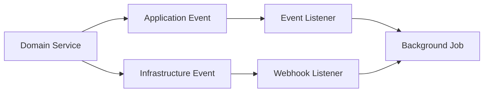
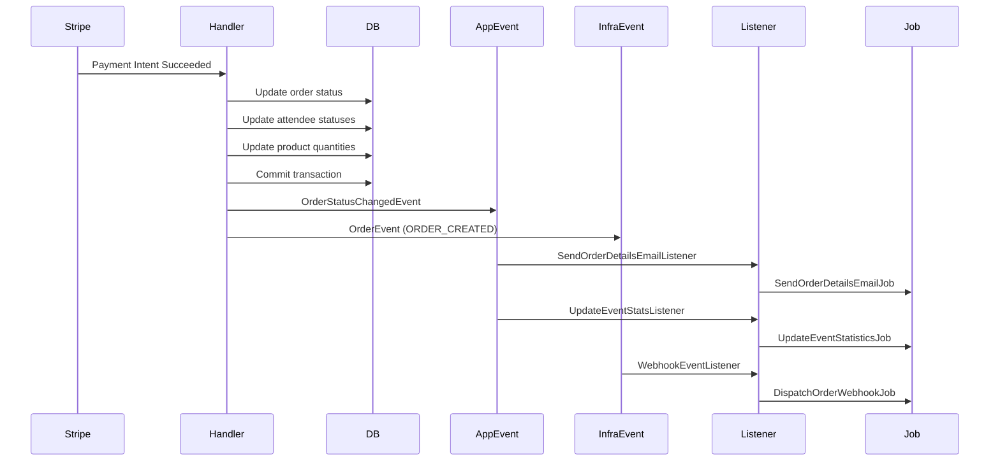

# Events and Background Jobs Architecture

## Overview

Hi.Events implements a dual-layer event architecture combining Laravel's event system with custom domain events. This enables clean separation between internal workflows (application events) and external integrations (infrastructure events).



## Architecture Components

### 1. Application Events

**Location**: `backend/app/Events/`

Used for internal domain logic and business workflows.

#### OrderStatusChangedEvent

**File**: `backend/app/Events/OrderStatusChangedEvent.php`

```php
class OrderStatusChangedEvent
{
    use Dispatchable;

    public function __construct(
        public OrderDomainObject $order,
        public bool $sendEmails = true,
        public bool $createInvoice = false,
    ) {}
}
```

**Purpose**: Triggered whenever order status changes (payment received, completion, cancellation).

**Listeners**:
- `SendOrderDetailsEmailListener` - Sends order confirmation
- `CreateInvoiceListener` - Generates invoice
- `UpdateEventStatsListener` - Updates statistics

**Usage**:
```php
OrderStatusChangedEvent::dispatch($order, sendEmails: true, createInvoice: true);
```

#### EventUpdateEvent

**File**: `backend/app/Events/EventUpdateEvent.php`

```php
class EventUpdateEvent
{
    use Dispatchable;

    public function __construct(
        private readonly EventDomainObject $event,
    ) {}
}
```

**Purpose**: Triggered when event details are updated.

**Usage**:
```php
EventUpdateEvent::dispatch($event);
```

### 2. Infrastructure Domain Events

**Location**: `backend/app/Services/Infrastructure/DomainEvents/`

Used for external webhook integrations and system-level events.

#### Event Types

**File**: `backend/app/Services/Infrastructure/DomainEvents/DomainEventType.php`

```php
enum DomainEventType: string
{
    // Product events
    case PRODUCT_CREATED = 'product.created';
    case PRODUCT_UPDATED = 'product.updated';
    case PRODUCT_DELETED = 'product.deleted';

    // Order events
    case ORDER_CREATED = 'order.created';
    case ORDER_UPDATED = 'order.updated';
    case ORDER_MARKED_AS_PAID = 'order.marked_as_paid';
    case ORDER_REFUNDED = 'order.refunded';
    case ORDER_CANCELLED = 'order.cancelled';

    // Attendee events
    case ATTENDEE_CREATED = 'attendee.created';
    case ATTENDEE_UPDATED = 'attendee.updated';
    case ATTENDEE_CANCELLED = 'attendee.cancelled';

    // Check-in events
    case CHECKIN_CREATED = 'checkin.created';
    case CHECKIN_DELETED = 'checkin.deleted';
}
```

#### Event Classes

**Base Event**: `backend/app/Services/Infrastructure/DomainEvents/BaseDomainEvent.php`

```php
abstract class BaseDomainEvent
{
    use Dispatchable;
}
```

**Concrete Events**: All in `backend/app/Services/Infrastructure/DomainEvents/Events/`

**OrderEvent**:
```php
class OrderEvent extends BaseDomainEvent
{
    public function __construct(
        public DomainEventType $type,
        public int $orderId,
    ) {}
}
```

**ProductEvent**:
```php
class ProductEvent extends BaseDomainEvent
{
    public function __construct(
        public DomainEventType $type,
        public int $productId,
    ) {}
}
```

**AttendeeEvent**:
```php
class AttendeeEvent extends BaseDomainEvent
{
    public function __construct(
        public DomainEventType $type,
        public int $attendeeId,
    ) {}
}
```

**CheckinEvent**:
```php
class CheckinEvent extends BaseDomainEvent
{
    public function __construct(
        public DomainEventType $type,
        public int $attendeeCheckinId,
    ) {}
}
```

#### Domain Event Dispatcher

**File**: `backend/app/Services/Infrastructure/DomainEvents/DomainEventDispatcherService.php`

```php
class DomainEventDispatcherService
{
    public function dispatch(BaseDomainEvent $event): void
    {
        try {
            Event::dispatch($event);
        } catch (Exception $e) {
            $this->logger->error('Failed to dispatch domain event', [
                'event' => get_class($event),
                'error' => $e->getMessage(),
            ]);
            throw $e;
        }
    }
}
```

**Usage**:
```php
$this->domainEventDispatcher->dispatch(
    new OrderEvent(
        type: DomainEventType::ORDER_CREATED,
        orderId: $order->getId()
    )
);
```

## 3. Event Listeners

**Location**: `backend/app/Listeners/`

Listeners react to events and coordinate side effects.

### Order Listeners

#### SendOrderDetailsEmailListener

**File**: `backend/app/Listeners/Order/SendOrderDetailsEmailListener.php`

```php
class SendOrderDetailsEmailListener
{
    public function handle(OrderStatusChangedEvent $event): void
    {
        if (!$event->sendEmails) {
            return;
        }

        dispatch(new SendOrderDetailsEmailJob($event->order));
    }
}
```

**Pattern**: Checks event flags and dispatches job if appropriate.

#### CreateInvoiceListener

**File**: `backend/app/Listeners/Order/CreateInvoiceListener.php`

```php
class CreateInvoiceListener
{
    public function __construct(
        private readonly InvoiceCreateService $invoiceCreateService
    ) {}

    public function handle(OrderStatusChangedEvent $event): void
    {
        if (!$event->createInvoice) {
            return;
        }

        $order = $event->order;

        if ($order->getStatus() !== OrderStatus::AWAITING_OFFLINE_PAYMENT->name
            && $order->getStatus() !== OrderStatus::COMPLETED->name) {
            return;
        }

        $this->invoiceCreateService->createInvoiceForOrder($order->getId());
    }
}
```

**Pattern**: Uses domain service directly (synchronous operation).

### Event Listeners

#### UpdateEventStatsListener

**File**: `backend/app/Listeners/Event/UpdateEventStatsListener.php`

```php
class UpdateEventStatsListener
{
    public function handle(OrderStatusChangedEvent $event): void
    {
        if (!$event->order->isOrderCompleted()) {
            return;
        }

        dispatch(new UpdateEventStatisticsJob($event->order));
    }
}
```

**Pattern**: Validates conditions before dispatching job.

### Webhook Listener

#### WebhookEventListener

**File**: `backend/app/Listeners/Webhook/WebhookEventListener.php`

```php
class WebhookEventListener
{
    public function handle(BaseDomainEvent $event): void
    {
        $queueName = $this->config->get('queue.webhook_queue_name');

        switch (get_class($event)) {
            case OrderEvent::class:
                DispatchOrderWebhookJob::dispatch(
                    orderId: $event->orderId,
                    eventType: $event->type,
                )->onQueue($queueName);
                break;

            case AttendeeEvent::class:
                DispatchAttendeeWebhookJob::dispatch(
                    attendeeId: $event->attendeeId,
                    eventType: $event->type,
                )->onQueue($queueName);
                break;

            case ProductEvent::class:
                DispatchProductWebhookJob::dispatch(
                    productId: $event->productId,
                    eventType: $event->type,
                )->onQueue($queueName);
                break;

            case CheckinEvent::class:
                DispatchCheckInWebhookJob::dispatch(
                    attendeeCheckInId: $event->attendeeCheckinId,
                    eventType: $event->type,
                )->onQueue($queueName);
                break;
        }
    }
}
```

**Pattern**: Routes infrastructure events to appropriate webhook jobs on dedicated queue.

## 4. Background Jobs

**Location**: `backend/app/Jobs/`

Jobs implement `ShouldQueue` for asynchronous processing.

### Order Jobs

#### SendOrderDetailsEmailJob

**File**: `backend/app/Jobs/Order/SendOrderDetailsEmailJob.php`

```php
class SendOrderDetailsEmailJob implements ShouldQueue
{
    use Dispatchable, InteractsWithQueue, Queueable, SerializesModels;

    public int $tries = 3;

    public function __construct(
        private readonly OrderDomainObject $order
    ) {}

    public function handle(SendOrderDetailsService $service): void
    {
        $service->sendOrderSummaryAndTicketEmails($this->order);
    }
}
```

**Features**:
- 3 retry attempts
- Automatically queued
- Serializes domain objects

### Webhook Jobs

All webhook jobs follow similar pattern:

**File**: `backend/app/Jobs/Order/Webhook/DispatchOrderWebhookJob.php`

```php
class DispatchOrderWebhookJob implements ShouldQueue
{
    use Dispatchable, InteractsWithQueue, Queueable, SerializesModels;

    public function __construct(
        public int $orderId,
        public DomainEventType $eventType,
    ) {}

    public function handle(WebhookDispatchService $webhookDispatchService): void
    {
        $webhookDispatchService->dispatchOrderWebhook(
            eventType: $this->eventType,
            orderId: $this->orderId,
        );
    }
}
```

**Other Webhook Jobs**:
- `DispatchAttendeeWebhookJob`
- `DispatchProductWebhookJob`
- `DispatchCheckInWebhookJob`

### Event Jobs

#### UpdateEventStatisticsJob

**File**: `backend/app/Jobs/Event/UpdateEventStatisticsJob.php`

```php
class UpdateEventStatisticsJob implements ShouldQueue
{
    use Dispatchable, InteractsWithQueue, Queueable, SerializesModels;

    public int $tries = 5;
    public int $backoff = 10; // seconds

    public function __construct(
        private readonly OrderDomainObject $order
    ) {}

    public function handle(EventStatisticsIncrementService $service): void
    {
        $service->incrementForOrder($this->order);
    }

    public function failed(Throwable $exception): void
    {
        logger()?->error('Failed to update event statistics', [
            'order' => $this->order->toArray(),
            'exception' => $exception,
        ]);
    }
}
```

**Features**:
- 5 retry attempts
- 10-second exponential backoff
- Custom failure handler

**Other Event Jobs**:
- `SendEventEmailJob` - Bulk emails to attendees
- `SendMessagesJob` - Batch message processing
- `UpdateEventPageViewsJob` - Page view tracking

### Question Jobs

**File**: `backend/app/Jobs/Question/ExportAnswersJob.php`

Exports survey/question responses.

## 5. Event Registration

**File**: `backend/app/Providers/EventServiceProvider.php`

```php
class EventServiceProvider extends ServiceProvider
{
    private static array $domainEventMap = [
        WebhookEventListener::class => [
            ProductEvent::class,
            OrderEvent::class,
            AttendeeEvent::class,
            CheckinEvent::class,
        ],
    ];

    public function boot(): void
    {
        $this->registerDomainEventListeners();
    }

    private function registerDomainEventListeners(): void
    {
        foreach (self::$domainEventMap as $listener => $events) {
            foreach ($events as $event) {
                Event::listen($event, [$listener, 'handle']);
            }
        }
    }

    public function shouldDiscoverEvents(): bool
    {
        return true; // Auto-discovers Order/Event listeners
    }
}
```

**Registration Strategy**:
- **Manual registration**: Infrastructure domain events → webhook listener
- **Auto-discovery**: Application events → Order/Event listeners (convention-based)

## Event Flow Examples

### Example 1: Order Payment Success

**Trigger**: Stripe payment intent succeeds

**File**: `backend/app/Services/Domain/Payment/Stripe/EventHandlers/PaymentIntentSucceededHandler.php`



**Flow**:

1. **Payment Handler** processes Stripe webhook
```php
public function handleEvent(PaymentIntent $paymentIntent): void
{
    $this->databaseManager->transaction(function () use ($paymentIntent) {
        $updatedOrder = $this->updateOrderStatuses($stripePayment);
        $this->updateAttendeeStatuses($updatedOrder);
        $this->quantityUpdateService->updateQuantities($updatedOrder);

        // Dispatch application event
        OrderStatusChangedEvent::dispatch($updatedOrder);

        // Dispatch infrastructure event
        $this->domainEventDispatcherService->dispatch(
            new OrderEvent(
                type: DomainEventType::ORDER_CREATED,
                orderId: $updatedOrder->getId()
            )
        );
    });
}
```

2. **Application Event** triggers 3 listeners:
   - Email listener → Email job
   - Invoice listener → Invoice creation (sync)
   - Statistics listener → Statistics job

3. **Infrastructure Event** triggers:
   - Webhook listener → Webhook job (on dedicated queue)

4. **Background Jobs** execute asynchronously:
   - Email (3 retries)
   - Statistics (5 retries, 10s backoff)
   - Webhook delivery

### Example 2: Manual Order Completion

**Trigger**: User completes order form (no payment required)

```php
public function handle(string $orderShortId, CompleteOrderDTO $dto): OrderDomainObject
{
    $updatedOrder = DB::transaction(function () use ($orderShortId, $dto) {
        $order = $this->getOrder($orderShortId);
        $updatedOrder = $this->updateOrder($order, $dto);
        $this->createAttendees($dto->products, $order);

        if (!$order->isPaymentRequired()) {
            $this->quantityUpdateService->updateQuantities($updatedOrder);
        }

        return $updatedOrder;
    });

    // Dispatch after transaction commits
    OrderStatusChangedEvent::dispatch($updatedOrder);

    if ($updatedOrder->isOrderCompleted()) {
        $this->domainEventDispatcherService->dispatch(
            new OrderEvent(
                type: DomainEventType::ORDER_CREATED,
                orderId: $updatedOrder->getId(),
            )
        );
    }

    return $updatedOrder;
}
```

**Key Pattern**: Events dispatched **after** transaction commits.

## Architectural Patterns

### 1. Dual Event System

**Why Two Systems?**

```
Application Events (app/Events/)
├── Internal workflows
├── Business logic triggers
├── Can be sync or async
└── Examples: OrderStatusChangedEvent, EventUpdateEvent

Infrastructure Events (Services/Infrastructure/DomainEvents/)
├── External integrations
├── Webhook delivery
├── Always async
├── Isolated failure domain
└── Examples: OrderEvent, ProductEvent, AttendeeEvent
```

### 2. Listener Responsibilities

Three distinct patterns:

#### Job Dispatcher (Most Common)

```php
public function handle(OrderStatusChangedEvent $event): void
{
    dispatch(new SendOrderDetailsEmailJob($event->order));
}
```

#### Direct Service Call (Synchronous)

```php
public function handle(OrderStatusChangedEvent $event): void
{
    $this->invoiceCreateService->createInvoiceForOrder($event->order->getId());
}
```

#### Router/Multiplexer

```php
public function handle(BaseDomainEvent $event): void
{
    switch (get_class($event)) {
        case OrderEvent::class:
            DispatchOrderWebhookJob::dispatch(...)->onQueue('webhooks');
            break;
    }
}
```

### 3. Job Design Patterns

**Retry Strategy**:
```php
// User-facing operations - fail fast
public int $tries = 3;

// Background statistics - eventual consistency OK
public int $tries = 5;
public int $backoff = 10; // seconds
```

**Failure Handling**:
```php
public function failed(Throwable $exception): void
{
    logger()->error('Job failed', [
        'job' => static::class,
        'data' => $this->data,
        'exception' => $exception,
    ]);
}
```

**Serialization**:
```php
// Domain objects auto-serialized
public function __construct(
    private readonly OrderDomainObject $order  // SerializesModels trait
) {}

// Or use primitive IDs for smaller payload
public function __construct(
    public int $orderId,
    public DomainEventType $eventType,
) {}
```

### 4. Transaction Boundaries

**Critical Pattern**: Events dispatched **after** DB transaction commits.

```php
// ✅ GOOD - Events after commit
DB::transaction(function() {
    // DB operations
});
OrderStatusChangedEvent::dispatch($order);

// ❌ BAD - Events inside transaction
DB::transaction(function() {
    // DB operations
    OrderStatusChangedEvent::dispatch($order); // May see uncommitted data
});
```

**Benefits**:
- Listeners see committed data
- Prevents duplicate processing on rollback
- Maintains referential integrity

### 5. Event Discovery vs Manual Registration

**Auto-discovered** (convention: `app/Listeners/{Domain}/{EventName}Listener.php`):
```
app/Listeners/Order/SendOrderDetailsEmailListener.php → OrderStatusChangedEvent
app/Listeners/Event/UpdateEventStatsListener.php → OrderStatusChangedEvent
```

**Manually registered** (cross-cutting concerns):
```php
private static array $domainEventMap = [
    WebhookEventListener::class => [
        ProductEvent::class,
        OrderEvent::class,
        AttendeeEvent::class,
    ],
];
```

## Best Practices

### 1. Choose the Right Event Type

**Use Application Events when**:
- Internal workflow coordination
- Multiple side effects needed
- May be sync or async
- Example: Order status changes → emails, invoices, stats

**Use Infrastructure Events when**:
- External integrations
- Webhook delivery
- Always async
- Isolated failure domain
- Example: Notify external systems of order creation

### 2. Keep Listeners Thin

```php
// ✅ GOOD - Listener dispatches job
public function handle(OrderStatusChangedEvent $event): void
{
    if ($event->sendEmails) {
        dispatch(new SendOrderDetailsEmailJob($event->order));
    }
}

// ❌ BAD - Business logic in listener
public function handle(OrderStatusChangedEvent $event): void
{
    $email = new OrderConfirmationEmail($event->order);
    Mail::send($email); // Blocking operation
}
```

### 3. Use Conditional Dispatch

```php
// Conditional based on event state
if ($event->sendEmails) {
    dispatch(new SendEmailJob($order));
}

// Conditional based on domain object
if ($order->isOrderCompleted()) {
    dispatch(new UpdateStatisticsJob($order));
}
```

### 4. Queue Separation

```php
// High-priority user-facing
SendOrderDetailsEmailJob::dispatch($order)->onQueue('emails');

// Lower-priority background
UpdateEventStatisticsJob::dispatch($order)->onQueue('stats');

// Separate failure domain
DispatchOrderWebhookJob::dispatch(...)->onQueue('webhooks');
```

### 5. Error Handling

```php
class UpdateEventStatisticsJob implements ShouldQueue
{
    public int $tries = 5;
    public int $backoff = 10;

    public function handle(EventStatisticsService $service): void
    {
        $service->incrementForOrder($this->order);
    }

    public function failed(Throwable $exception): void
    {
        logger()->error('Statistics update failed', [
            'order_id' => $this->order->getId(),
            'error' => $exception->getMessage(),
        ]);

        // Optionally: send alert, log to external service, etc.
    }
}
```

## Summary

Hi.Events implements a sophisticated event-driven architecture:

**Components**:
- 3 application events (internal workflows)
- 4 infrastructure event classes + 13 event types (webhooks)
- 10 background jobs (async processing)
- 7 event listeners (orchestration)

**Strengths**:
- Clear separation of concerns (internal vs external events)
- Transactional safety (events after commits)
- Extensible via auto-discovery
- Robust retry/failure handling
- Queue isolation prevents cascading failures

**Total Architecture**:
```
Domain Service → Event Dispatch
                     ↓
        ┌────────────┴────────────┐
        ↓                         ↓
Application Event        Infrastructure Event
        ↓                         ↓
Event Listener            Webhook Listener
        ↓                         ↓
Background Job            Webhook Job
        ↓                         ↓
  Send Email              External System
  Update Stats
  Generate Invoice
```

## Related Documentation

- [Architecture Overview](architecture-overview.md)
- [Domain-Driven Design](domain-driven-design.md)
- [Repository Pattern](repository-pattern.md)
