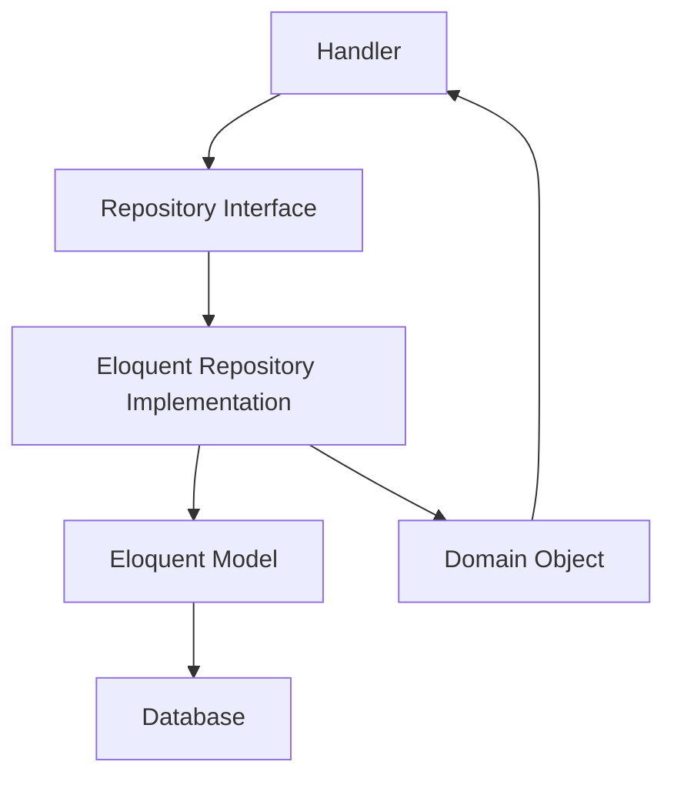

# Repository Pattern in Hi.Events

## Overview

Hi.Events uses a clean implementation of the Repository Pattern that provides abstraction between the domain layer and data persistence. All repositories follow interface-based design and return domain objects instead of Eloquent models.

## Architecture



## Core Components

### 1. Base Repository Interface

**Location**: `backend/app/Repository/Interfaces/RepositoryInterface.php`

Provides 40+ methods for common CRUD operations:

#### Core CRUD Methods

```php
// Create
public function create(array $attributes): DomainObjectInterface;
public function insert(array $inserts): bool; // Bulk insert

// Read
public function all(array $columns = ['*']): Collection;
public function findById(int $id, array $columns = ['*']): DomainObjectInterface;
public function findFirst(int $id, array $columns = ['*']): ?DomainObjectInterface;
public function findWhere(array $where, array $columns = ['*']): Collection;
public function findFirstWhere(array $where, array $columns = ['*']): ?DomainObjectInterface;
public function findWhereIn(string $field, array $values): Collection;

// Update
public function updateFromDomainObject(int $id, DomainObjectInterface $do): DomainObjectInterface;
public function updateFromArray(int $id, array $attributes): DomainObjectInterface;
public function updateWhere(array $attributes, array $where): int;

// Delete
public function deleteById(int $id): bool;
public function deleteWhere(array $conditions): int;
```

#### Pagination & Counting

```php
public function paginate(int $limit = 20, array $columns = ['*']): LengthAwarePaginator;
public function paginateWhere(array $where, int $limit = 20): LengthAwarePaginator;
public function countWhere(array $conditions): int;
```

#### Increment/Decrement

```php
public function increment(int $id, string $column, int|float $amount = 1): int;
public function decrement(int $id, string $column, int|float $amount = 1): int;
public function incrementWhere(array $where, string $column, int|float $amount = 1): int;
```

#### Special Operations

```php
// Eager loading
public function loadRelation(string|Relationship $relationship): static;

// Include soft deleted
public function includeDeleted(): static;

// Required domain object mapping
public function getDomainObject(): string; // Returns FQCN of domain object
```

### 2. Base Repository Implementation

**Location**: `backend/app/Repository/Eloquent/BaseRepository.php`

Abstract class that implements all interface methods with:
- Automatic model hydration to domain objects
- Flexible where conditions
- Model reset pattern
- Eager loading support

#### Key Implementation Features

**Flexible Where Conditions**:

```php
// Simple key-value
$where = ['event_id' => 1];

// Array with operator
$where = [['status', '!=', 'RESERVED']];

// Callable for complex queries
$where[] = static function (Builder $builder) {
    $builder->where('name', 'like', '%search%')
            ->orWhere('email', 'like', '%search%');
};
```

**Automatic Hydration**:

```php
private function hydrateDomainObjectFromModel(Model $model): DomainObjectInterface
{
    $domainObject = new ($this->getDomainObject())();

    foreach ($model->attributesToArray() as $attribute => $value) {
        $method = 'set' . ucfirst(Str::camel($attribute));
        if (is_callable([$domainObject, $method])) {
            $domainObject->$method($value);
        }
    }

    // Handle eager-loaded relationships
    $this->handleEagerLoads($model, $domainObject);

    return $domainObject;
}
```

## Creating a Repository

### Step 1: Define Interface

**File**: `backend/app/Repository/Interfaces/AffiliateRepositoryInterface.php`

```php
<?php

namespace HiEvents\Repository\Interfaces;

use HiEvents\DomainObjects\AffiliateDomainObject;
use HiEvents\DataTransferObjects\QueryParamsDTO;
use Illuminate\Pagination\LengthAwarePaginator;

interface AffiliateRepositoryInterface extends RepositoryInterface
{
    public function findByEventId(int $eventId, QueryParamsDTO $params): LengthAwarePaginator;

    public function incrementSales(int $affiliateId, float $amount): void;
}
```

### Step 2: Create Implementation

**File**: `backend/app/Repository/Eloquent/AffiliateRepository.php`

```php
<?php

namespace HiEvents\Repository\Eloquent;

use HiEvents\DomainObjects\AffiliateDomainObject;
use HiEvents\DomainObjects\Generated\AffiliateDomainObjectAbstract;
use HiEvents\Models\Affiliate;
use HiEvents\Repository\Interfaces\AffiliateRepositoryInterface;
use Illuminate\Database\Query\Builder;

class AffiliateRepository extends BaseRepository implements AffiliateRepositoryInterface
{
    protected function getModel(): string
    {
        return Affiliate::class; // Eloquent model
    }

    public function getDomainObject(): string
    {
        return AffiliateDomainObject::class; // Domain object returned
    }

    public function findByEventId(int $eventId, QueryParamsDTO $params): LengthAwarePaginator
    {
        $where = [
            [AffiliateDomainObjectAbstract::EVENT_ID, '=', $eventId]
        ];

        // Add search if query provided
        if ($params->query) {
            $where[] = static function (Builder $builder) use ($params) {
                $builder
                    ->orWhere(AffiliateDomainObjectAbstract::NAME, 'ilike', '%' . $params->query . '%')
                    ->orWhere(AffiliateDomainObjectAbstract::CODE, 'ilike', '%' . $params->query . '%')
                    ->orWhere(AffiliateDomainObjectAbstract::EMAIL, 'ilike', '%' . $params->query . '%');
            };
        }

        $this->model = $this->model->orderBy(
            column: $params->sort_by ?? AffiliateDomainObject::getDefaultSort(),
            direction: $params->sort_direction ?? 'desc',
        );

        return $this->paginateWhere(
            where: $where,
            limit: $params->per_page,
            page: $params->page,
        );
    }

    public function incrementSales(int $affiliateId, float $amount): void
    {
        $this->model->where('id', $affiliateId)
            ->increment('total_sales', 1, [
                'total_sales_gross' => $this->db->raw('total_sales_gross + ' . $amount)
            ]);
    }
}
```

### Step 3: Register in Service Provider

**File**: `backend/app/Providers/RepositoryServiceProvider.php`

```php
class RepositoryServiceProvider extends ServiceProvider
{
    private static array $interfaceToConcreteMap = [
        AffiliateRepositoryInterface::class => AffiliateRepository::class,
        OrderRepositoryInterface::class => OrderRepository::class,
        EventRepositoryInterface::class => EventRepository::class,
        // ... more mappings
    ];

    public function register(): void
    {
        foreach (self::$interfaceToConcreteMap as $interface => $concrete) {
            $this->app->bind($interface, $concrete);
        }
    }
}
```

## Usage in Handlers

### Basic Usage

```php
class CreateAffiliateHandler
{
    public function __construct(
        private readonly AffiliateRepositoryInterface $affiliateRepository,
    ) {}

    public function handle(int $eventId, int $accountId, UpsertAffiliateDTO $dto): AffiliateDomainObject
    {
        // Check for existing
        $existing = $this->affiliateRepository->findFirstWhere([
            'event_id' => $eventId,
            'code' => $code,
        ]);

        if ($existing) {
            throw new ResourceConflictException('Affiliate with this code already exists');
        }

        // Create new affiliate
        return $this->affiliateRepository->create([
            'event_id' => $eventId,
            'account_id' => $accountId,
            'name' => $dto->name,
            'code' => $code,
            'email' => $dto->email,
            'status' => $dto->status->value,
        ]);
    }
}
```

### Using Domain Object Constants

**Always use constants** for field names:

```php
// ✅ GOOD - Using constants
$affiliate = $this->affiliateRepository->findFirstWhere([
    AffiliateDomainObjectAbstract::EVENT_ID => $eventId,
    AffiliateDomainObjectAbstract::CODE => $code,
    AffiliateDomainObjectAbstract::STATUS => AffiliateStatus::ACTIVE->value,
]);

// ❌ BAD - Using strings
$affiliate = $this->affiliateRepository->findFirstWhere([
    'event_id' => $eventId,
    'code' => $code,
]);
```

### Eager Loading

```php
$event = $this->eventRepository
    ->loadRelation(EventSettingDomainObject::class)
    ->loadRelation(EventStatisticDomainObject::class)
    ->findById($eventId);

// Event now has eager-loaded settings and statistics
$settings = $event->getEventSettings();
$statistics = $event->getEventStatistics();
```

### Complex Queries

```php
public function findByEventId(int $eventId, QueryParamsDTO $params): LengthAwarePaginator
{
    $where = [
        [OrderDomainObjectAbstract::EVENT_ID, '=', $eventId],
        [OrderDomainObjectAbstract::STATUS, '!=', OrderStatus::RESERVED->name],
    ];

    // Complex search with OR conditions
    if ($params->query) {
        $where[] = static function (Builder $builder) use ($params) {
            $builder
                ->where(
                    DB::raw("(first_name||' '||last_name)"),
                    'ilike',
                    '%' . $params->query . '%'
                )
                ->orWhere(OrderDomainObjectAbstract::EMAIL, 'ilike', '%' . $params->query . '%')
                ->orWhere(OrderDomainObjectAbstract::PUBLIC_ID, 'ilike', '%' . $params->query . '%');
        };
    }

    // Dynamic filters
    if (!empty($params->filter_fields)) {
        $this->applyFilterFields($params, OrderDomainObject::getAllowedFilterFields());
    }

    // Sorting
    $this->model = $this->model->orderBy(
        column: $params->sort_by ?? OrderDomainObject::getDefaultSort(),
        direction: $params->sort_direction ?? 'desc',
    );

    return $this->paginateWhere($where, $params->per_page, page: $params->page);
}
```

### Relationship Constraints

```php
public function findOrdersAssociatedWithProducts(
    int $eventId,
    array $productIds,
    array $orderStatuses
): Collection {
    return $this->handleResults(
        $this->model
            ->whereHas('order_items', static function (Builder $query) use ($productIds) {
                $query->whereIn('product_id', $productIds);
            })
            ->whereIn('status', $orderStatuses)
            ->where('event_id', $eventId)
            ->get()
    );
}
```

## Best Practices

### 1. Favor Base Methods Over Custom Methods

**Prefer existing base methods**:

```php
// ✅ GOOD - Use base method
$affiliate = $repository->findFirstWhere(['event_id' => $eventId]);

// ❌ BAD - Custom method for common pattern
$affiliate = $repository->findByEventId($eventId);
```

Only create custom methods for **complex, reusable queries**:

```php
// ✅ GOOD - Complex query worth a custom method
public function findOrdersAssociatedWithProducts(
    int $eventId,
    array $productIds,
    array $orderStatuses
): Collection;

// ✅ GOOD - Domain-specific business logic
public function incrementSales(int $affiliateId, float $amount): void;
```

### 2. Use Type Hints

```php
public function handle(int $eventId, UpsertDTO $dto): AffiliateDomainObject
{
    // Handler knows it receives a domain object
    $affiliate = $this->repository->create([...]);

    // Type-safe method calls
    $affiliateId = $affiliate->getId();
    $status = $affiliate->getStatus();

    return $affiliate;
}
```

### 3. Handle Null Safely

```php
// findById throws if not found
$affiliate = $this->repository->findById($id);

// findFirstWhere returns null if not found
$affiliate = $this->repository->findFirstWhere(['code' => $code]);

if (!$affiliate) {
    throw new NotFoundHttpException('Affiliate not found');
}
```

### 4. Use Transactions at Handler Level

```php
public function handle(CreateOrderDTO $dto): OrderDomainObject
{
    return $this->databaseManager->transaction(function () use ($dto) {
        // Multiple repository calls in transaction
        $event = $this->eventRepository->findById($dto->eventId);
        $order = $this->orderRepository->create([...]);
        $items = $this->orderItemRepository->insert([...]);

        return $order;
    });
}
```

### 5. Avoid N+1 Queries

```php
// ✅ GOOD - Eager load relationships
$orders = $this->orderRepository
    ->loadRelation(OrderItemDomainObject::class)
    ->loadRelation(AttendeeDomainObject::class)
    ->findWhere(['event_id' => $eventId]);

// ❌ BAD - N+1 query
$orders = $this->orderRepository->findWhere(['event_id' => $eventId]);
foreach ($orders as $order) {
    $items = $order->getOrderItems(); // Lazy load for each order
}
```

## Common Repository Patterns

### Pagination with Filters

```php
public function findByEventId(int $eventId, QueryParamsDTO $params): LengthAwarePaginator
{
    $where = [['event_id', '=', $eventId]];

    if ($params->query) {
        $where[] = static fn($builder) => $builder->where('name', 'ilike', '%' . $params->query . '%');
    }

    if ($params->filter_fields) {
        $this->applyFilterFields($params, DomainObject::getAllowedFilterFields());
    }

    $this->model = $this->model->orderBy(
        $params->sort_by ?? 'created_at',
        $params->sort_direction ?? 'desc'
    );

    return $this->paginateWhere($where, $params->per_page, page: $params->page);
}
```

### Bulk Operations

```php
// Bulk insert
$this->repository->insert([
    ['name' => 'Item 1', 'event_id' => 1],
    ['name' => 'Item 2', 'event_id' => 1],
]);

// Bulk update
$this->repository->updateWhere(
    ['status' => 'CANCELLED'],
    ['event_id' => 1, 'payment_status' => 'PENDING']
);

// Bulk delete
$this->repository->deleteWhere(['status' => 'EXPIRED']);
```

### Increment/Decrement

```php
// Increment single field
$this->repository->increment($id, 'view_count', 1);

// Increment with additional updates
$this->model->where('id', $affiliateId)
    ->increment('total_sales', 1, [
        'total_sales_gross' => DB::raw('total_sales_gross + ' . $amount)
    ]);
```

### Finding by Short ID

```php
public function findByShortId(string $orderShortId): ?OrderDomainObject
{
    return $this->findFirstByField('short_id', $orderShortId);
}
```

## Testing Repositories

### Unit Testing with Mocks

```php
use Mockery;
use Tests\TestCase;

class CreateAffiliateHandlerTest extends TestCase
{
    use DatabaseTransactions;

    public function test_creates_affiliate_successfully(): void
    {
        $repository = Mockery::mock(AffiliateRepositoryInterface::class);

        $repository->shouldReceive('findFirstWhere')
            ->once()
            ->with(['event_id' => 1, 'code' => 'TEST'])
            ->andReturn(null);

        $repository->shouldReceive('create')
            ->once()
            ->with([
                'event_id' => 1,
                'name' => 'Test Affiliate',
                'code' => 'TEST',
            ])
            ->andReturn(new AffiliateDomainObject());

        $handler = new CreateAffiliateHandler($repository);
        $result = $handler->handle(1, 1, new UpsertAffiliateDTO(...));

        $this->assertInstanceOf(AffiliateDomainObject::class, $result);
    }
}
```

## Repository Method Reference

### Query Methods

| Method | Returns | Description |
|--------|---------|-------------|
| `all()` | Collection | Get all records |
| `findById()` | DomainObject | Find by ID (throws if not found) |
| `findFirst()` | ?DomainObject | Find by ID (returns null if not found) |
| `findWhere()` | Collection | Find multiple by conditions |
| `findFirstWhere()` | ?DomainObject | Find first by conditions |
| `findWhereIn()` | Collection | Find where column in array |
| `paginate()` | LengthAwarePaginator | Paginate all |
| `paginateWhere()` | LengthAwarePaginator | Paginate with conditions |
| `countWhere()` | int | Count matching records |

### Mutation Methods

| Method | Returns | Description |
|--------|---------|-------------|
| `create()` | DomainObject | Create single record |
| `insert()` | bool | Bulk insert (no domain objects returned) |
| `updateFromArray()` | DomainObject | Update by ID with array |
| `updateFromDomainObject()` | DomainObject | Update by ID with domain object |
| `updateWhere()` | int | Bulk update matching records |
| `deleteById()` | bool | Delete by ID |
| `deleteWhere()` | int | Bulk delete matching records |

### Utility Methods

| Method | Returns | Description |
|--------|---------|-------------|
| `increment()` | int | Increment column |
| `decrement()` | int | Decrement column |
| `loadRelation()` | self | Add eager load (chainable) |
| `includeDeleted()` | self | Include soft deleted (chainable) |

## Related Documentation

- [Architecture Overview](architecture-overview.md)
- [Domain-Driven Design](domain-driven-design.md)
- [Database Schema](database-schema.md)
