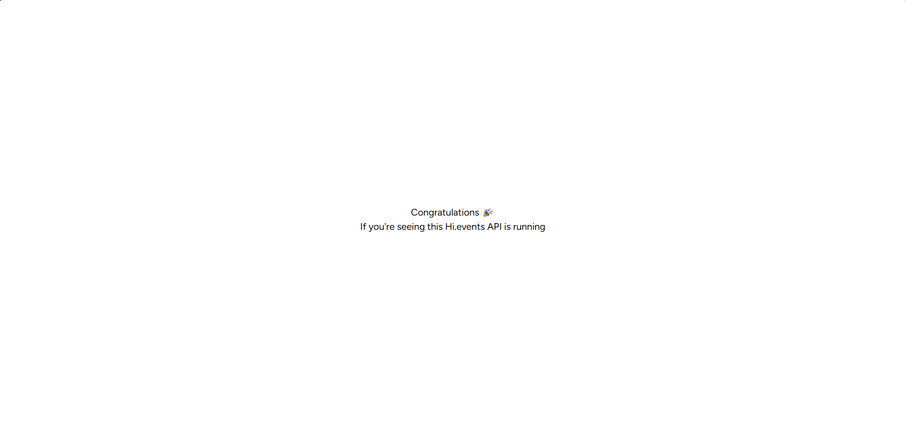

# Running HI.Events locally

## Prerequisites

1. [Install PHP 8.2 or higher](https://www.php.net/downloads.php)
2. [Install Composer](https://getcomposer.org/download/)
3. Install Postgres
4. Install Node.js and yarn

### Php Extensions

Make sure you have the following PHP extensions installed:

1. gd
2. pdo_pgsql
3. sodium
4. curl
5. intl

If you don't have them installed, you can go to the `php.ini` file and uncomment the lines that contain the extensions by removing the `;` at the beginning of the line.

## Setup

First, fork the repository and clone it to your local machine. You can do this by running the following command in your terminal:

```bash
git clone https://github.com/youraccount/Hi.Events.git

```

The project has two main directories: `backend` and `frontend`. The `backend` directory contains the Laravel application, and the `frontend` directory contains the React JS application.

### Server Setup

1. Before running the application, you need to create a `.env` file in the root directory of the project. You can copy the `.env.example` file and rename it to `.env`.

```bash
cd backend
cp .env.example .env
```

2. Configure the database connection in the `.env` file. You can use the following configuration:

```bash
DB_CONNECTION=pgsql
DB_HOST=localhost
DB_PORT=5432
DB_DATABASE=anynamethatyouwant
DB_USERNAME=yourusername
DB_PASSWORD=yoursecretpassword
```

3. Configure the mail server in the `.env` file. You can use the following configuration:

```bash
MAIL_MAILER=smtp
MAIL_HOST=smtp.mailtrap.io
MAIL_PORT=2525
MAIL_USERNAME=youremail
MAIL_PASSWORD=yourpassword
MAIL_ENCRYPTION=tls
MAIL_FROM_ADDRESS=youremail
MAIL_FROM_NAME="${APP_NAME}"
```

Note that you can use any mail server you want. In this example, we are using Mailtrap. You can create an account on [Mailtrap](https://mailtrap.io/) and get the SMTP credentials.

4. Configure the URLs in the `.env` file. You can use the following configuration:

```bash
APP_URL=http://localhost
APP_PORT=8000
APP_FRONTEND_URL=http://localhost:*
```

Note that the `APP_FRONTEND_URL` is set to `http://localhost:*` to ensure that the frontend can access the backend and will not be blocked by CORS.

5. Add the frontend URL to the `CORS` configuration in the .env file:

```bash
CORS_ALLOW_ORIGIN=http://localhost:5678
```

6. Install the project dependencies by running the following command:

```bash
composer install
```

7. Create a new database in Postgres with the name you specified in the `.env` file.

8. Run the following command to generate the application key:

```bash
php artisan migrate
```

9. Run the following command to start the server:

```bash
php artisan serve
```

You should see the following screen when you open the browser and navigate to `http://localhost:8000`:


### Frontend Setup

1. Go to the `frontend` directory and create a `.env` file by copying the `.env.example` file:

```bash
cd frontend
cp .env.example .env
```

2. Configure the .env file with the following settings:

```bash
VITE_API_URL_CLIENT=http://localhost:8000
VITE_API_URL_SERVER=http://localhost:8000
VITE_FRONTEND_URL=http://localhost:5678

VITE_STRIPE_PUBLISHABLE_KEY=pk_test_51Ofu1CJKnXOyGeQuDPUHiZcJxZozRuERiv4vQRBtCscwTbxOL574cxUjAoNRL2YLCumgC5160pl6kvTIiAc9mOeM0058KAWQ55
```

3. Install the project dependencies by running the following command:

```bash
yarn install
```

### Client Side Rendering

Run the following command to start the frontend application in client-side rendering mode (Development mode):

```bash
yarn dev:csr
```

Now you can open the browser and navigate to `http://localhost:5678` to see the application running.

---
Instead, if you want to run the application in Production mode, you can run the following command:

```bash
yarn build:csr
yarn preview:csr
```

You can open the browser and navigate to `http://localhost:4173` to see the application running.

### Server Side Rendering

Coming soon...